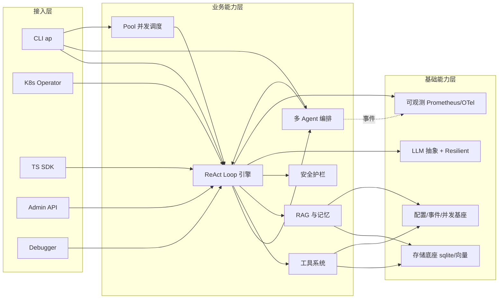

# AgentPrimordia 架构设计 · 高层架构设计

> 本文档为《AICoding 架构设计》核心产物之一，对应**高层架构设计**阶段（Phase 3，Gate G3）。
> 上游输入：主理人转交的用户原始诉求 + G1 已审核 `material_digest.md`（D1–D18）+ G2 已审核 `research_report.md`；
> 下游输出：驱动《系统设计》《部署设计》《安全设计》《UserStory》四份文档的撰写。
> 本文是 `system-architect` 与 `product-story-designer` 的唯一上游边界基线，所有系统边界、模块范围、MVP 范围、角色场景与功能清单均已在此冻结（X1 TS 对等口径、X4 CRD apiVersion 已**经中间确认**定稿，详见附录 C 检查点 2/3）。

---

## 0. 元信息：修订记录

```yaml
标题: AgentPrimordia - 高层架构设计 v0.1
版本: v0.1
状态: Reviewing（边界冻结，待 G3 人工审核）   # Draft | Reviewing | Approved | Deprecated
创建日期: 2026-07-07
最后更新: 2026-07-07
作者: business-architect（许边界）
评审人:
  - team-lead（主理人）
  - 用户（G3 人工审核）

关联文档:
  上游输入:
    - 业务原始诉求: 主理人注入（"启动 AICoding 架构专家团，基于项目背景和资料生成完整架构方案"）
    - 行业调研报告: .workbuddy/output/research_report.md（G2 已审核，12/12 通过）
    - 现有架构知识库: .workbuddy/output/material_digest.md（G1 已审核，7/7 通过，D1–D18）
  下游产出:
    - 系统设计: AICoding架构设计-2-系统设计.md
    - 部署设计: AICoding架构设计-3-部署设计.md
    - 安全设计: AICoding架构设计-4-安全设计.md
    - UserStory: AICoding架构设计-5-UserStory.md
```

| 版本 | 日期 | 作者 | 变更内容 | 评审状态 |
| --- | --- | --- | --- | --- |
| v0.1 | 2026-07-07 | business-architect（许边界） | 初稿：需求/调研/方案/业务架构/产品需求五章 + 附录 C 自检 | Reviewing（X1/X4 经中间确认定稿，架构边界冻结，待 G3 人工审核） |

> **版本管理纪律**：破坏性变更（章节结构调整 / 关键决策反转）升 MAJOR；新增章节、扩充内容升 MINOR。

---

## 1. 需求概要

### 1.1 需求概要说明

AgentPrimordia 是从 CodeCast 生产验证提炼的**通用 Go Agent 开发框架**，服务于**任何想用 Go 构建 AI Agent 应用的开发者**，覆盖 ReAct 推理、多 Agent 编排、工具系统、三层记忆与 RAG、LLM 抽象等核心场景。本期由**用户启动 AICoding 架构专家团、基于项目背景与资料生成完整架构方案**驱动，目标是冻结高层架构边界，为下游系统/部署/安全设计与 UserStory 提供唯一基线。

### 1.2 关键决策摘要

| 编号 | 决策类别 | 决策内容 | 关联章节 |
| --- | --- | --- | --- |
| D1 | 范围决策 | MVP 聚焦核心 Go Agent 框架能力（ReAct/工具/记忆/RAG/多 Provider/Resilient/核心编排）；TS SDK 100% 对等、A2A gRPC 迁移、K8s Operator CRD 统一、性能审计 121 项全清均延后（对齐 research §4.2） | §6.1 需求边界 |
| D2 | 技术选型决策 | 基座采用**自研 Go（AgentPrimordia）** + 对标 cloudwego/eino、tmc/langchaingo（仅模式参考，不引入跨语言依赖）；向量存储按规模外置（InMemory/Qdrant/Milvus/pgvector） | §3.2 / §4 / §5 |
| D3 | MVP / 完整版边界 | MVP = 核心链路（InMemory RAG + 核心编排 + CLI + 基础 K8s 部署）；完整版 = 外部向量库 + TS Edge 补齐 + K8s Operator 正式 CRD + gRPC 可选 A2A | §4.3 |
| D4 | 复用 vs 新建 | 复用 Prometheus/OTel/Grafana 标准生态与 modernc.org/sqlite 纯 Go 驱动；业务核心（ReAct/编排/工具/记忆/LLM 抽象/护栏）全自研 | §2.4 / §5.2 |
| D5 | 部署形态 | **私有化优先**（Go 原生、零 CGO、可私有化）；提供 CLI（ap）+ K8s Operator（AgentDeployment CRD）两种接入形态，非托管 SaaS | §4.2 / §5.2 |

**硬指标**：≥ 3 条，≤ 5 条；每条决策必须能映射到正文具体章节（已满足：D1–D5 均落到 §4/§5/§6）。

### 1.3 价值主张

| 价值维度 | 量化目标 | 度量指标 | 当前值 | 目标值 | 截止时间 |
| --- | --- | --- | --- | --- | --- |
| 效率 | 从零到首个 Agent 的样板代码压减 | 创建 Agent 所需代码行数 | 50+ 行（D9 §主题） | ≤ 3 行（ap.NewAgent） | MVP 上线 |
| 效率 | Pool 并发调度时延稳定 | 10 任务 × 5 并发 P99 | 1.4s（D2 §亮点 Demo） | ≤ 1.4s 且性能审计 Quick Win 全清 | 完整版上线 |
| 合规 | 供应链安全与最小依赖 | 运行时核心依赖数 + CI 漏洞数 | 依赖 1 / 2 个 stdlib CVE 未修（D4 P0.1） | 依赖 1（白名单 3 类）+ govulncheck 0 漏洞 | MVP 上线 |
| 成本 | 单实例并发承载 | 单实例稳定支撑并发 Agent 任务数 | 10×5 已验证（D2 §K8s 示例 max 10） | ≥ 10 并发且 P99 ≤ 1.4s | 完整版上线 |
| 体验 | TS SDK 与 Go 核心能力对齐（Core 100% / Edge 70%，经中间确认 X1） | TS 核心模块对齐率 | 声明 100% / 实测 60–70%（D4 §0） | Core 100% 对齐、Edge 70% 延后（经中间确认 X1） | MVP 上线 |

**硬指标**：业务价值 ≥ 2 条 + 技术/成本价值 ≥ 1 条；每条必须可量化（已满足：效率 2 + 合规 1 + 成本 1 + 体验 1，均为数字指标，无"提升/优化"类模糊词）。

---

## 2. 需求分析 & 痛点解构

### 2.1 核心角色关注点

| 角色 | 业务身份 | 主要操作 | Top1 关心点 | 来源 |
| --- | --- | --- | --- | --- |
| 甲方决策者（框架维护者 / 技术负责人） | 开源项目 Owner / CodeCast 技术决策者 | 技术路线决策、版本发布、社区与生态维护 | 框架长期可维护性与技术债务可控（D4 §0/§2.4 大文件耦合、R-06） | D2 / D4 |
| 最终用户 A（Go Agent 应用开发者） | 一线开发者 | ap.NewAgent 创建 Agent、注册工具、接 LLM、跑 Pool | 上手快、样板少、公共 API 稳定（D9 DX 重构；D10 API 稳定性承诺） | D2 §快速开始 / D9 / D10 |
| 最终用户 B（应用架构师 / SRE） | 基于框架构建应用的架构师与运维 | K8s 部署（AgentDeployment CRD）、可观测监控、容量规划 | 生产可用性、可观测性、私有化部署合规（D2 §K8s；D8 安全加固） | D2 / D8 |
| 受影响方：终端应用用户 | 使用基于本框架开发的 AI 应用的最终客户 | 通过应用触达 Agent 能力（问答/任务执行） | 响应时延、回答质量、隐私与 PII 防护（D8 PII/路径穿越防护） | D8 |
| 受影响方：TS 生态开发者 | 使用 @agentprimordia/sdk 的 TypeScript 开发者 | 使用 TS SDK 构建 Agent | TS 与 Go 能力对齐程度 / 接口一致性（X1 经中间确认定为 Core 100% / Edge 70%，缓解 R-01） | D4 / D12 |

**硬指标**：≥ 3 类（甲方决策者 / 最终用户 / 受影响方各至少一行；已满足：5 行，覆盖三类维度）；每行有 Top1 关心点，禁止笼统"使用方便"（已满足）。

### 2.2 核心痛点

| 编号 | 痛点描述 | 现象 / 数据 | 影响角色 | 影响程度 | 优先级 |
| --- | --- | --- | --- | --- | --- |
| P1 | TS SDK "100% 功能对等" 对外声明与实测不符，存在失真 | 实测 TS 端 60–70% 对等，存 7 处未实现（4 处真桩：HNSW O(n) 全表扫描、A2A TCP 无连接池、operator YAML 自实现、tool-learning avgLatencyMs=0 bug）（D4 §0/§2.5） | 受影响方：TS 开发者 / 品牌 | 高（社区信任 + 合规风险，R-01） | P1 |
| P1 | Go 运行版本含未修复的 stdlib CVE | 当前 1.26.3，含 2 个 stdlib CVE（GO-2026-5039 net/textproto、GO-2026-5037 crypto/x509），可达触发链 dag.go→ollama_provider→email plugin→discovery（D4 §3 P0.1） | 甲方决策者 / SRE | 高（安全合规、供应链安全，R-02） | P1 |
| P2 | 性能审计大量发现未闭环，影响高并发可用性 | 约 121 项（12 Critical / 40 High），如 Tool Executor 缺 panic recovery、熔断器半开 race、MCP 缺 timeout（D18 §总体概览 / Phase 1） | 最终用户 B / 终端用户 | 中–高（稳定性、P99 回归，R-04） | P2 |
| P2 | Go 核心大文件耦合，维护与 API 漂移风险 | collaboration.go 990 / dispatcher.go 773 / dag.go 761 等 Top10 大文件累计 >6000 LoC（D4 §2.4） | 甲方决策者 | 中（可维护性、API 漂移 R-04） | P2 |
| P3 | 文档根路径两处并存，引用歧义 | AgentPrimordia/docs/ 与 agentprimordia/docs/ 两处均存在（X6） | 甲方决策者 / 文档维护 | 低（可维护性） | P3 |

**优先级标准**：
- **P1**：直接影响业务核心流程或合规底线，不解决无法上线（已满足：P1 ×2，均含现象/数据佐证，且 §2.3 有对应目标 V1/V2）。
- **P2**：影响用户体验或运营效率，可在 MVP 后迭代。
- **P3**：体验型 / 长尾问题，列入完整版或后续版本。

**硬指标**：每条痛点有"现象 / 数据"佐证；P1 ≥ 1 条且必须在 §2.3 有对应目标（已满足：P1 ×2，分别对齐 V1、V2）。

### 2.3 期待目标

| 编号 | 目标描述 | 对齐痛点 | 度量指标 | 当前值 | 目标值 | 截止时间 |
| --- | --- | --- | --- | --- | --- | --- |
| V1 | TS SDK 对外对等口径定为 "Core 100% / Edge 70%" 并文档化 roadmap（经中间确认 X1） | P1 | 对外声明与实测一致度 | 声明 100% / 实测 60–70% | 声明 = Core 100% / Edge 70% | MVP 上线 |
| V2 | Go 版本统一 1.26.4+，CI 门禁 govulncheck 0 漏洞 | P1 | 运行时版本 + CI 漏洞数 | 1.26.3 / 2 CVE | 1.26.4+ / 0 漏洞 | MVP 上线 |
| V3 | 核心链路性能达标且性能审计 Quick Win 全清 | P2 | Pool 10×5 P99 / Critical 项闭环率 | P99 1.4s / 12 Critical 待清 | P99 ≤ 1.4s 稳定 / Quick Win 100% | 完整版上线 |
| V4 | 核心大文件拆分降低维护风险 | P2 | 单文件最大 LoC | collaboration.go 990 | ≤ 400 LoC/文件 | 完整版上线 |
| V5 | 文档根路径统一为单一权威根 | P3 | 文档根数量 | 2 处 | 1 处权威根 | MVP 上线 |

**硬指标**：每条目标有数字 + 对齐 ≥1 条痛点；P1 痛点有对应 V 级目标（已满足：V1←P1、V2←P1）。

### 2.4 基线复用

| 复用类别 | 现有能力 | 复用方式 | 来源系统 | 备注 |
| --- | --- | --- | --- | --- |
| 核心模式基座 | CodeCast 生产验证提炼的 Pool/FileLock/Scope、ReAct Loop、工具分发、增强记忆 | 直接沉淀为 internal/ 模块（D1 §8） | CodeCast 生产环境 | 提取模式而非复制代码 |
| 可观测生态 | Prometheus + OpenTelemetry + Grafana（3 预置 Dashboard） | 桥接复用（D2 §可观测性） | 标准开源生态 | 本项目 otel/metrics 已桥接 |
| 存储底座 | modernc.org/sqlite（纯 Go、零 CGO） | 白名单依赖直接复用（D1 §2.1） | 白名单第三方依赖 | 用于 memory / ecosystem/plugins/kv 持久化 |
| 向量存储 | InMemory（内置）/ Qdrant / Milvus / pgvector（外置，按规模） | 内置直接复用；外置按 D2 §Vector DB 阈值切换 | 外部设施或内置 | U-01 待确认实际数据量 |
| CLI 入口 | ap（init/run/debug/loop/test/mcp/plugin/doctor/completion） | 直接复用（D2 §CLI 命令） | 本项目 cmd/ap | v0.8 已重构 DX |

**硬指标**：必须先盘点再决定新建；凡列入"功能缺口"的能力，必须先在本节确认基线无法覆盖（已满足：基线已盘点，功能缺口均基于基线增量）。

### 2.5 功能缺口

| 阶段 | 功能缺口 | 必要性 | 优先级 | 对齐目标 |
| --- | --- | --- | --- | --- |
| 核心运行时 | ReAct Loop + 20+ 钩子、工具系统（FS/Shell/Web/Knowledge+MCP+Plugin）、三层记忆+向量+RAG(RRF)、10+ LLM Provider+Resilient、Pool、Guardrail/ACL/Sandbox/PII | 必须 | MVP | V3 |
| 编排与协作 | Pipeline/Handoff/Parallel/DAG/GroupChat/A2A（核心路径） | 必须 | MVP | V3 |
| 企业级部署 | CLI（ap）+ 基础 K8s Deployment/YAML + 可观测 Dashboard | 重要 | MVP | — |
| 双语言 SDK | TS SDK 核心能力对等（Core 100% / Edge 70%，经中间确认 X1） | 重要 | MVP（Core） | V1 |
| 工程与治理 | Go 1.26.4 CVE 修复 + 供应链安全 CI 门禁；文档根统一 | 必须（安全/质量） | MVP | V2 / V5 |
| 完整版延展 | 外部向量库默认、TS Edge 补齐、K8s Operator 正式 CRD（apiVersion agent.agentprimordia.io/v1alpha1，经中间确认 X4）、A2A gRPC 可选、性能审计全清、大文件拆分 | 重要 | 完整版 | V3 / V4 |

**硬指标**：每条缺口对齐 §2.3 至少一条目标；MVP 缺口在 §6.3 功能清单中对应有 MVP 范围标记（已满足：MVP 缺口 F1–F15 均标 MVP ✅）。

> **§2 完成自检（中间确认协议 §2.4）**：本阶段决策均为"范围/价值/角色"梳理，未触及 X1–X6 具体裁决；X1/X4 已显式单列待中间确认（见附录 C）。§2.1 未命中方案分歧（角色/痛点/目标属需求收敛，非 ≥2 方案且影响下游契约的分歧）；§2.3 反向验证：Q1 推翻仅重写 §2（约 1 章节、0.5 人日），可控；Q2 角色/痛点不改变对外承诺，不可感知；Q3 与用户诉求"生成完整架构方案"一致。详见附录 C。

---

## 3. 行业调研

### 3.1 行业标杆系统分析

| 标杆系统 | 厂商 / 来源 | 场景覆盖 | 技术亮点 | 商业模式 | 适用度 |
| --- | --- | --- | --- | --- | --- |
| LangChain / LangGraph（B1） | LangChain（社区 + LangChain 平台 SaaS） | LLM 应用编排、状态化多 Agent、RAG | LangGraph 图编排（Pregel/Beam 启发）+ Checkpoint + HITL | 开源 Apache-2.0 + 企业云 | 中（能力基线参考） |
| cloudwego/eino（B2） | CloudWeGo（字节，开源） | Go 原生 LLM 应用、组件编排、Agent | 组件化 + 编排流，借鉴 LangChain/ADK，遵循 Go 惯例 | 开源 Apache-2.0 | 高（最贴近同行） |
| tmc/langchaingo（B3） | tmc（社区，开源） | Go 版 LangChain：链/工具/记忆/Provider/向量 | 统一接口对接 LLM Provider、向量库、AI 服务 | 开源 Apache-2.0 | 高（组件级参考） |
| Mastra（B4） | Mastra（社区 + Cloud SaaS） | TS AI Agent、Workflow、Memory、RAG、Evals、可观测 | Agents/Workflows/Memory/Observability 一体化，opinionated | 开源 + 云订阅 | 中（TS SDK 对标） |
| CrewAI / AutoGen（B5） | CrewAI（社区+企业）/ Microsoft | 多 Agent 协作：角色扮演 / 对话式 | CrewAI 角色团队；AutoGen 对话群聊 | 开源（CrewAI 含商业层） | 低（跨语言依赖否决） |

**硬指标**：≥ 3 家；含 ≥1 家头部 SaaS（B1 LangChain+LangSmith SaaS）+ ≥1 家开源/自研代表（B2/B3 Go 开源）（已满足：5 家）。

### 3.2 方案对标及优先级打分

**对比矩阵**（每行权重之和 = 1.00，权重理由：本项目 Go 1.26+ 仅标准库+白名单依赖、接口优先、并发原生、私有化友好；故"场景契合度"权重最高 0.30，"合规可控性"次高 0.20）：

| 评估维度 | 权重 | B1 LangChain | B2 eino | B3 langchaingo | B4 Mastra | B5 CrewAI/AutoGen |
| --- | --- | --- | --- | --- | --- | --- |
| 场景契合度 | 0.30 | 3 | 5 | 4 | 3 | 2 |
| 技术成熟度 | 0.20 | 5 | 4 | 4 | 4 | 4 |
| 集成难度（反向） | 0.15 | 2 | 5 | 5 | 2 | 2 |
| 成本（反向） | 0.15 | 3 | 4 | 4 | 3 | 3 |
| 合规可控性 | 0.20 | 4 | 5 | 5 | 4 | 4 |
| **加权总分** | **1.00** | **3.45** | **4.65** | **4.35** | **3.25** | **2.95** |

**结论摘要**：
- **优先借鉴**：**B2 cloudwego/eino**（4.65）—— 理由：场景契合度 5（Go 原生、组件化+编排，同赛道）、合规可控性 5（Go/Apache-2.0/私有化）、集成难度 5（Go 内可直接对标实现）；作为组件化与编排设计的主要对标对象。
- **部分借鉴**：**B3 tmc/langchaingo**（4.35）借鉴 Provider/向量/记忆组件级实现；**B1 LangChain/LangGraph**（3.45）借鉴能力矩阵基线与"图编排 + Checkpoint + HITL"模式；**B4 Mastra**（3.25）作为 TS SDK 结构与能力映射对标。
- **不借鉴（否决）**：**B5 CrewAI/AutoGen**（2.95）—— 否决理由：Python 运行时与本项目"Go 1.26+ 仅标准库+白名单依赖、零 CGO"（D1 §2）硬约束不兼容，禁止作为运行时依赖引入；其多 Agent 编排模式已被本项目 DAG/GroupChat/Handoff 覆盖（research §3.2）。

> 事实 / 推断 / 建议 / 风险区分：§3.1 标杆事实来自 research_report §2（含置信度）；§3.2 打分为建议性评估，非本阶段裁决；跨语言框架依赖引入已被 D1 §2 硬约束否决，属"建议非裁决"中的否决结论。

### 3.3 完整报告参考

- 完整报告链接：`.workbuddy/output/research_report.md`（G2 已审核，12/12 通过）
- 调研工具：`research-analyst`（tech-research-advisor 模式）
- 调研日期：2026-07-07
- 调研归档：`research_report.md`（标杆 B1–B5、5 维加权矩阵、MVP 建议、待确认项 U-01~U-05、依赖项 D-01~D-05）

---

## 4. 方案决策

### 4.1 价值定位澄清

**定位三段式**：

```
对外价值（客户侧）: 帮助 Go 开发者以最少样板（ap.NewAgent 3 行）构建生产级 AI Agent；私有化部署、供应链安全（零 CGO + 白名单依赖）、公共 API 稳定性承诺。
对内价值（运营侧）: 源自 CodeCast 生产验证、接口优先、并发原生、最小外部依赖；技术债务可控、可维护、TDD 强制。
差异化价值        : 唯一"Go 原生 + 零 CGO + 仅标准库 + 白名单依赖 3 类"的通用 Agent 框架；协议式微内核 17 个 Capable 接口；生产验证 + 完整安全护栏（Guardrail/ACL/Sandbox/PII）+ K8s Operator + 双语言 SDK。可量化：运行时核心依赖仅 1（modernc.org/sqlite）、样板 3 行、Pool 10×5 P99 1.4s。
```

**与产品矩阵的关系**：本系统在"通用 Go Agent 开发框架"中承担**基座与运行时内核**职责，向上通过 CLI（ap）/ K8s Operator / TS SDK / Admin API 触达开发者与运维，向下依赖 LLM Provider、外部向量库（按规模）与可观测生态，形成"开发 → 编排 → 运行 → 观测 → 治理"完整业务闭环（见 §5.2、§5.3）。

### 4.2 系统定位澄清

| 维度 | 内容 |
| --- | --- |
| 系统名称 | AgentPrimordia（通用 Go Agent 开发框架） |
| 系统类型 | 已有系统扩展（v1.0.0 已发布；本期为架构边界冻结与设计基线梳理，非从零新建） |
| 部署形态 | 私有化优先（Go 原生、零 CGO、可私有化）；提供 CLI（ap）+ K8s Operator（AgentDeployment CRD）两种接入形态；非托管 SaaS |
| 多租户 | 否（框架/库形态，非 SaaS 多租户；运行时隔离由宿主机 / K8s 命名空间承担） |
| 服务对象 | Go Agent 应用开发者、应用架构师/SRE、TS SDK 开发者、基于本框架的终端应用用户 |
| 上游依赖 | LLM Provider（OpenAI/Anthropic/Gemini/Ollama/Azure/Qwen/GLM/Cohere/Mistral 等 10+）、外部向量库（Qdrant/Milvus/pgvector，按规模）、Prometheus/Grafana 生态 |
| 下游消费者 | 基于本框架构建的 AI Agent 应用、K8s Operator 编排的 AgentDeployment 实例、TS SDK（@agentprimordia/sdk）用户 |
| 边界（不做） | 不引入跨语言框架作为运行时依赖（受 D1 §2 硬约束否决）；不做非 Go 运行时后端；本期不做托管 SaaS 平台 |

### 4.3 MVP 与完整版决策

| 阶段 | 时间窗 | 范围（功能编号） | 架构差异点 | 退出标准 | 不做（延后） |
| --- | --- | --- | --- | --- | --- |
| MVP | W1 ~ W6 | F1–F13（含 N1 非功能） | 单进程/单实例；InMemory 向量（零依赖）；A2A 默认 JSON-RPC+SSE；TS 仅 Core 对等（Core 100% / Edge 70%，经中间确认 X1）；K8s 仅 Deployment+YAML（apiVersion agent.agentprimordia.io/v1alpha1，经中间确认 X4） | 跑通核心场景（ap.NewAgent 3 行 + RAG + Pool 10×5）+ CI govulncheck 0 漏洞 + 文档根统一 | F14–F20：外部向量库默认、TS Edge 全补齐、K8s 正式 CRD、A2A gRPC、性能审计全清、大文件拆分 |
| 完整版 | W7 ~ W18 | + F14–F20 | 外部向量库（按规模切换）；K8s Operator 正式 CRD（apiVersion agent.agentprimordia.io/v1alpha1，经中间确认 X4）；TS Edge 70% 补齐；A2A gRPC 可选绑定；性能审计 Phase 1–4 闭环；大文件拆分 | 部署稳定 30 天 + 99.95% 可用性 + 性能审计 Quick Win/Critical 全清 + TS Core 100% 验证 | — |

**演进纪律**（重要）：
- ✅ MVP 的架构骨架是完整版的**子集**，不允许 MVP 上线后推倒重来（MVP 已包含 ReAct/工具/记忆/RAG/编排/Pool/护栏/可观测/CLI 全栈，完整版仅为外延扩展）。
- ✅ MVP 中可 Mock/简化的能力（如外部向量库、gRPC A2A）在本节明确"完整版替换计划"，不引入完整版无法继承的临时架构。
- ❌ 禁止：MVP 为赶工引入"完整版无法继承"的临时架构（如临时单库 → 分库分表大改）；本期禁止引入跨语言运行时依赖。

> **§4 完成自检（中间确认协议 §2.4）**：本阶段触及 X1（TS 对等口径）、X4（CRD apiVersion）两项对外承诺/部署契约决策，已分别发起 `[中间确认]`（见附录 C 检查点 2/3）。其余决策（部署形态私有化、复用标准生态、MVP 范围）均属研究建议且未跨感知边界，§2.1 未命中、§2.3 反向验证可控（详见附录 C）。

---

## 5. 业务架构设计

### 5.1 业务架构图

> 三层结构：**接入层（触达/网关）→ 业务能力层（核心模块）→ 基础能力层（底座/数据）**。数据流：实线 = 同步调用，虚线 = 异步事件，粗线 = 主链路。

```mermaid
flowchart TB
    subgraph 接入层（触点与网关）
        CLI[CLI ap: init/run/debug/loop/test/mcp/plugin]
        OP[K8s Operator: AgentDeployment CRD]
        TS[TS SDK: @agentprimordia/sdk]
        ADM[Admin HTTP API: /api/agents/metrics/health]
        DBG[Debugger: ap debug / loop trace / pprof]
    end
    subgraph 业务能力层（业务层）
        REACT[ReAct Loop 引擎 + 20+ 生命周期钩子]
        ORCH[多 Agent 编排: Pipeline/Handoff/Parallel/DAG/GroupChat/A2A]
        TOOL[工具系统: FileSystem/Shell/Web/Knowledge + MCP + Plugin]
        RAG[三层记忆 + 向量 + RAG（RRF 融合）]
        POOL[Pool 并发调度: 信号量/会话隔离/重试]
        GUARD[安全护栏: Guardrail/ACL/Sandbox/PII/路径穿越]
    end
    subgraph 基础能力层（基础层与底座）
        LLM[LLM 抽象 + Resilient: 10+ Provider 熔断/重试/降级]
        STORE[存储底座: modernc.org/sqlite / 向量 InMemory / Qdrant/Milvus/pgvector]
        OBS[可观测: Prometheus + OTel + Grafana Dashboard]
        INFRA[配置/事件总线/并发锁 FileLock/Scope]
    end
    CLI --> REACT
    OP --> REACT
    TS --> REACT
    ADM --> REACT
    DBG --> REACT
    REACT ==> ORCH
    REACT --> TOOL
    REACT --> RAG
    REACT --> POOL
    REACT --> GUARD
    ORCH --> REACT
    TOOL --> STORE
    RAG --> STORE
    POOL --> REACT
    GUARD --> REACT
    REACT --> LLM
    REACT -.事件.-> OBS
    ORCH -.事件.-> OBS
    TOOL --> INFRA
    RAG --> INFRA
    POOL --> INFRA
```

> 图示说明：因当前运行时缺少 graphviz `dot` 与 `diagrams` 包，**本图以 Mermaid 直接绘制并内嵌**（满足模板 §5.1 三层结构 + 数据流方向要求）；如需 PNG/SVG 资产，可在具备 graphviz 的环境用 diagrams-generator 按上述节点重渲染。

### 5.2 系统依赖架构

| 依赖类型 | 系统 / 模块 | 提供方 | 依赖能力 | 接入方式 | 同步/异步 | 关键约束 |
| --- | --- | --- | --- | --- | --- | --- |
| 上游 | LLM Provider（OpenAI/Anthropic/Gemini/Ollama/Azure/Qwen/GLM/Cohere/Mistral 等） | 第三方 LLM 厂商 | 补全/流式/工具调用/嵌入 | HTTPS / REST（net/http） | 同步（含 SSE 流式） | 主+fallback 降级；熔断阈值 5；重试 3 次指数退避（D3 §4.2） |
| 上游 | 外部向量库（Qdrant / Milvus / pgvector） | 外部设施（按规模） | 向量写入/召回 | Go REST 客户端 / SQL | 同步 | 依 D2 §Vector DB 阈值切换；MVP 先用 InMemory（U-01） |
| 上游 | Prometheus / Grafana | 标准开源生态 | 指标抓取 / 看板 | Pull / HTTP | 异步（抓取） | 预置 3 Dashboard；指标 label 维度完整（D2 §可观测性） |
| 下游 | 基于框架的 AI Agent 应用 | 开发者 | 运行 Agent / 多 Agent 编排 | Go API（pkg/） | 同步 | 公共 API 稳定性承诺（Stable 冻结，D10） |
| 下游 | K8s Operator 编排的 AgentDeployment | 平台/部署组 | 声明式部署 / HPA | CRD + Controller（**apiVersion = agent.agentprimordia.io/v1alpha1，经中间确认 X4**） | 异步（调谐） | Finalizer/Status 聚合；HPA 基于 Pod 指标（D8） |
| 下游 | TS SDK 用户 | TS SDK 组 | 与 Go 对等的 Agent 能力 | npm 包 | 同步 | 对等口径 Core 100% / Edge 70%（经中间确认 X1） |
| 复用底座 | modernc.org/sqlite | 白名单依赖 | 记忆/插件 KV 持久化 | 进程内 Go 驱动（零 CGO） | 同步 | 仅 internal/memory 与 ecosystem/plugins/kv 使用（D1 §2.1） |
| 复用底座 | OTel / OpenTelemetry | 标准生态 | Trace 导出 | OTLP | 异步 | 本项目 otel/ 已桥接（D2） |

**硬指标**：
- 每条依赖明确"接入方式 + 同步/异步 + 关键约束"（已满足）。
- 所有 P1 痛点对应核心能力均可在本表找到依赖来源：P1(TS 失真)→TS SDK 下游行；P1(CVE)→LLM Provider 上游行（Resilient 降级约束）+ 运行版本治理（§6 F12）。

### 5.3 业务闭环

**业务主链路**（端到端）：

```
用户输入/任务 → [ReAct Loop 推理] → RAG 检索（向量+FTS+RRF 融合）→ LLM 生成（Resilient 熔断/重试/降级）→ 工具执行（Scope/ACL/Sandbox 校验）→ 观测/护栏拦截 → 响应返回 → [Pool 并发调度多 Agent] → 持久化 Checkpoint → 反馈回路
```

**关键反馈回路**：

| 回路 | 触发点 | 反馈对象 | 反馈机制 | 价值 |
| --- | --- | --- | --- | --- |
| 业务效果回路 | Agent 单次任务完结 / 质量评估 | RAG 记忆与 Episode 摘要 | 自动写入 Memory（topics/importance/cleanup） | 持续优化检索与上下文 |
| 运营监控回路 | 指标异常（P99 延迟 / 熔断打开 / 漏洞） | SRE / 运维（Grafana + Admin API） | Prometheus 实时告警 + Admin /api/metrics | 快速响应稳定性与安全风险 |
| 模型迭代回路 | Resilient 降级 / 工具连续失败 | LLM Provider 配置 / 编排策略 | 熔断状态机 + 降级切换 + 编排重试 | 提升可用性与容错 |
| 治理反馈回路 | CVE / 性能审计发现 | 工程治理（CI 门禁 / 大文件拆分） | govulncheck + 性能基准回归 | 供应链安全与性能可控 |

**运营主线**：
- 每日：SRE 看 Grafana（Agent Runtime / LLM Operations / Cost Tracking）3 Dashboard，关注 P99、熔断率、Token 成本；开发者用 `ap loop trace/inspect` 排查单 Agent。
- 每周：框架维护者复盘性能审计 Critical/High 闭环率与 CVE 状态（govulncheck 0 为目标）。
- 每月：回顾 TS SDK 对齐进度（Core 100% / Edge 70%，经中间确认 X1）与文档一致性（X6）。

> 关键词自检：本节含"业务闭环""主链路""反馈回路"，满足业务闭环硬指标。

> **§5 完成自检（中间确认协议 §2.4）**：业务架构图（三层不缺层）、依赖架构、业务闭环均已产出；X1/X4 仅影响 §5.2 个别行（TS SDK 下游、CRD apiVersion），不影响三层结构与主链路设计。§2.1 未命中新方案分歧；§2.3：Q1 推翻仅改 §5.2 两行（可控）；Q2 X1/X4 已单列中间确认；Q3 与用户诉求一致。详见附录 C。

---

## 6. 产品需求及原型

### 6.1 需求边界

**In-Scope**（本期必做，≤ 15 条）：

```
F1. ReAct Loop 引擎（含 20+ 生命周期钩子）
F2. 工具系统（FileSystem/Shell/Web/Knowledge + MCP + Plugin）
F3. 三层记忆 + 向量 + RAG（RRF 融合，InMemory 零依赖）
F4. 10+ LLM Provider + Resilient（熔断/重试/降级）
F5. 多 Agent 编排（Pipeline/Handoff/Parallel/DAG/GroupChat）
F6. Pool 并发调度（信号量 / 会话隔离 / 重试）
F7. 安全护栏（Guardrail / ACL / Sandbox / PII / 路径穿越防护）
F8. 可观测性（Prometheus + OTel + Grafana 预置 Dashboard）
F9. CLI（ap）全子命令 + 调试器（ap debug / loop trace）
F10. K8s 基础部署（Deployment + YAML；CRD apiVersion = agent.agentprimordia.io/v1alpha1，经中间确认 X4）
F11. TS SDK 核心能力对等（Core 100% / Edge 70%，经中间确认 X1）
F12. Go 1.26.4 CVE 修复 + 供应链安全 CI 门禁（govulncheck/Trivy/SBOM）
F13. 文档根路径统一（X6）
N1. 非功能：运行时核心依赖仅 1（modernc.org/sqlite）、零 CGO；单实例稳定支撑 ≥10 并发 Agent 任务（Pool P99 ≤ 1.4s）
```

**Out-of-Scope**（本期不做，必须列原因）：

| 编号 | 不做的事 | 原因 | 后续计划 |
| --- | --- | --- | --- |
| O1 | A2A gRPC + protobuf 迁移（D17 v2） | 当前 JSON-RPC+SSE 已是 Google A2A 标准三种绑定之一（research 表 C），零额外依赖；过早迁移引入复杂度（R-03） | 完整版 / 可选性能路径 |
| O2 | 外部向量库（Qdrant/Milvus/pgvector）默认启用 | 按 D2 §Vector DB 阈值，<10万文档用 InMemory；实际数据量待 U-01 确认 | 完整版（按规模切换） |
| O3 | TS SDK Edge 能力 100% 补齐（HNSW 真实实现 / operator controller / A2A gRPC） | 实测 Edge 仅 60–70%，分阶段补齐（D4 §5 P2），避免失真承诺（R-01） | 完整版 / 后续版本 |
| O4 | K8s Operator CRD apiVersion 统一与 Finalizer 增强 | CRD group/version = agent.agentprimordia.io/v1alpha1，经中间确认 X4，Finalizer 增强由部署设计阶段承接 | 由部署设计阶段承接 |
| O5 | 性能审计 121 项全清（D18 Phase 1–4） | Quick Win 优先，全清延后以避免阻塞 MVP（R-04） | 完整版 / 后续版本 |
| O6 | 引入跨语言框架作为运行时依赖（LangChain/LangGraph/CrewAI 等） | 受 D1 §2 硬约束（Go 1.26+ 仅标准库+白名单依赖、零 CGO）否决 | 不做 |

**硬指标**：In-Scope ≤ 15 条（已满足：F1–F13 + N1 = 14 条）；Out-of-Scope ≥ 3 条（已满足：O1–O6 = 6 条）。

### 6.2 产品模块全景图

**模块卡片**（每个模块必填字段）：

| 模块名称 | 一级归属 | 责任团队 | 上游 | 下游 | MVP 是否包含 |
| --- | --- | --- | --- | --- | --- |
| CLI（ap） | 接入层 | 框架核心组（cmd/ap） | 开发者终端 | ReAct/编排/调试器 | 是 |
| K8s Operator | 接入层 | 平台/部署组（operator/） | K8s API Server | AgentDeployment 实例 | 是（Deployment+YAML；apiVersion agent.agentprimordia.io/v1alpha1，经中间确认 X4） |
| TS SDK | 接入层 | SDK 组（sdk/typescript/） | Go 公共 API | TS 开发者 | 是（Core 100% / Edge 70%，经中间确认 X1） |
| Admin HTTP API | 接入层 | 框架核心组（admin/） | 运维/监控 | ReAct/指标 | 是 |
| Debugger | 接入层 | 框架核心组（debugger/） | 开发者 | ReAct/pprof | 是 |
| ReAct Loop 引擎 | 业务能力层 | 框架核心组（agent/） | LLM/记忆/工具/Pool | 编排/护栏 | 是 |
| 多 Agent 编排 | 业务能力层 | 框架核心组（orchestration/） | ReAct/MessageBus | ReAct/部署 | 是 |
| 工具系统 | 业务能力层 | 框架核心组（tools/） | 存储底座/并发锁 | ReAct | 是 |
| RAG & 记忆 | 业务能力层 | 框架核心组（memory/） | 存储底座/LLM 嵌入 | ReAct | 是 |
| Pool 并发调度 | 业务能力层 | 框架核心组（pool/） | ReAct/并发锁 | ReAct | 是 |
| 安全护栏 | 业务能力层 | 工程治理组（guardrail/security/） | 工具/LLM | ReAct | 是 |
| LLM 抽象 + Resilient | 基础能力层 | 框架核心组（llm/） | LLM Provider | ReAct | 是 |
| 存储底座 | 基础能力层 | 框架核心组（memory/persist/pgvector） | 外部向量库/sqlite | 工具/RAG | 是 |
| 可观测底座 | 基础能力层 | 工程治理组（metrics/otel/） | Prometheus/Grafana | 全局 | 是 |
| 配置/事件/并发基座 | 基础能力层 | 框架核心组（config/events/concurrency） | — | 全局 | 是 |



### 6.3 功能清单

| 编号 | 一级模块 | 二级功能 | 功能描述 | 优先级 | MVP 范围 | 完整版范围 | 对齐目标 |
| --- | --- | --- | --- | --- | --- | --- | --- |
| F1 | 接入层 | CLI（ap）全子命令 | init/run/debug/loop/test/mcp/plugin/doctor/completion | P0 | ✅ | ✅ | V3 |
| F2 | 接入层 | K8s 基础部署 | Deployment + YAML（不含 CRD 统一） | P1 | ✅ | ✅ | — |
| F3 | 接入层 | TS SDK 核心对等 | 与 Go 核心能力对齐（Core 100% / Edge 70%，经中间确认 X1） | P0 | ✅ | ✅ | V1 |
| F4 | 业务能力层 | ReAct Loop 引擎 | 推理循环 + 20+ 生命周期钩子 | P0 | ✅ | ✅ | V3 |
| F5 | 业务能力层 | 工具系统 | Builtin（FS/Shell/Web/Knowledge）+ MCP + Plugin | P0 | ✅ | ✅ | V3 |
| F6 | 业务能力层 | 三层记忆 + 向量 + RAG | SQLite FTS5 + Vector + RRF 融合（InMemory） | P0 | ✅ | ✅ | V3 |
| F7 | 业务能力层 | 多 LLM Provider + Resilient | 10+ Provider + 熔断/重试/降级 | P0 | ✅ | ✅ | V2 |
| F8 | 业务能力层 | 多 Agent 编排 | Pipeline/Handoff/Parallel/DAG/GroupChat | P0 | ✅ | ✅ | V3 |
| F9 | 业务能力层 | Pool 并发调度 | 信号量 / 会话隔离 / 重试 | P0 | ✅ | ✅ | V3 |
| F10 | 业务能力层 | 安全护栏 | Guardrail/ACL/Sandbox/PII/路径穿越 | P0 | ✅ | ✅ | — |
| F11 | 基础能力层 | LLM 抽象 + Resilient 底座 | Provider 接口 + Embedder + 状态机 | P0 | ✅ | ✅ | V2 |
| F12 | 基础能力层 | 存储底座 | modernc sqlite / 向量 InMemory | P0 | ✅ | ✅ | V3 |
| F13 | 基础能力层 | 可观测性 | Prometheus + OTel + Grafana Dashboard | P1 | ✅ | ✅ | — |
| F14 | 工程治理 | Go 1.26.4 CVE 修复 + CI 门禁 | govulncheck/Trivy/SBOM 0 漏洞 | P0 | ✅ | ✅ | V2 |
| F15 | 工程治理 | 文档根统一 | X6 单权威根 | P2 | ✅ | ❌ | V5 |
| F16 | 完整版延展 | 外部向量库 | Qdrant/Milvus/pgvector 按规模切换 | P2 | ❌ | ✅ | — |
| F17 | 完整版延展 | A2A gRPC 可选绑定 | D17 v2 性能路径 | P2 | ❌ | ✅ | — |
| F18 | 完整版延展 | TS Edge 补齐 | HNSW/operator/A2A gRPC（Edge 70%） | P2 | ❌ | ✅ | V1 |
| F19 | 完整版延展 | K8s Operator 正式 CRD | 统一 apiVersion = agent.agentprimordia.io/v1alpha1（经中间确认 X4） | P1 | ❌ | ✅ | — |
| F20 | 完整版延展 | 性能审计全清 | D18 Phase 1–4 闭环 | P2 | ❌ | ✅ | V3 |

**硬指标**：
- 每个 P0 功能必须在 MVP 范围内为 ✅（即 **P0 = MVP 边界**，本期冻结）。已满足：F1/F3/F4/F5/F6/F7/F8/F9/F10/F11/F12/F14 全部 P0 且 MVP ✅。
- 每个功能反向映射到 §2.5 功能缺口 + §2.3 期待目标（已满足：F1–F15 对应核心运行时/编排/部署/SDK/治理缺口与 V1–V5）。

### 6.4 产品原型 - 开发者工作台（CLI / Go API）

**核心页面清单**：

| 页面 | 用途 | 关键交互 | MVP |
| --- | --- | --- | --- |
| Agent 创建页（Go API / ap init） | 3 行创建带记忆/RAG/Hook 的 Agent | `ap.NewAgent(name, sysPrompt, model, opts...)` 链式注入 | ✅ |
| Agent 运行页（ap run / 代码） | 执行单次/多轮 Agent 任务 | 传入 Prompt → 返回 Response + Thought/ToolCall 流 | ✅ |
| RAG 调试页（ap loop trace/inspect/resume） | 查看 ReAct 轨迹、检索与上下文 | trace 时间轴回放、inspect 状态、resume 断点 | ✅ |
| Pool 调度页（代码 / ap 示例） | 多 Agent 并发任务编排 | 配置 MaxConcurrency/RetryPolicy → 提交 Task | ✅ |
| 工具注册页（代码 / MCP/plugin） | 注册 Builtin/MCP/Plugin 工具 | WithToolkit / MCPClient / PluginLoader | ✅ |

**关键交互约束**：
- 创建到首跑：核心路径 ≤ 3 行代码（对齐 V1 效率目标）。
- 调试响应：ap loop trace 触发到呈现 P99 ≤ 1.4s（对齐 V3）。

**原型链接**：无 Figma/Axure（框架以代码/CLI 为界面，详见 D2 §快速开始 / D9）。

### 6.5 产品原型 - 运维 / 管理端（Admin API + K8s Operator + Grafana）

**核心页面清单**：

| 页面 | 用途 | 关键交互 | MVP |
| --- | --- | --- | --- |
| Agent 管理列表（Admin /api/agents） | 全量 Agent 查询与状态 | 筛选 / 详情 / 停止（/api/agents/:id/stop） | ✅ |
| 指标面板（/api/metrics + Grafana） | Agent Runtime / LLM Ops / Cost Tracking | 实时刷新 / 多维下钻 | ✅ |
| 健康检查页（/healthz / /readyz / /livez，来自 TS SDK HealthServer 对齐） | 探针 | K8s 探针接入 | ✅ |
| K8s 部署页（AgentDeployment YAML） | 声明式部署 + HPA | kubectl apply；autoscaling min1/max10 | ✅（Deployment+YAML；CRD 统一待 X4） |
| 告警/预警面板 | 熔断/漏洞/P99 异常 | 实时告警 + 一键干预 | ✅ |

**原型链接**：无独立前端（运维以 API + Grafana + kubectl 为界面，详见 D2 §K8s / D8）。

---

## 附录 A：生成流程方法论

> 本附录为高层架构设计的生成方法论，描述每一步的目标、工具与产物形态，作为正文章节的产出依据（元信息，不按业务替换）。

### A.0 生成流程总览

| 步骤 | 名称 | 核心产出 | 落入正文章节 |
| --- | --- | --- | --- |
| Step0 | 业务基础知识库构建 | material_digest.md（D1–D18） | （为全文提供输入） |
| Step1 | 行业调研分析 | research_report.md（标杆/矩阵/MVP） | §3 行业调研 |
| Step2 | 需求分析 / 痛点解构 | 需求画像卡 | §2 需求分析 & 痛点解构 |
| Step3 | 能力盘点，系统定位 | 价值定位 + 系统定位 | §4 方案决策 / §5.2 系统依赖架构 |
| Step4 | 生成系统高层架构设计 | 本文档主文档 | §1 ~ §5 |
| Step5 | 产品需求及原型 | 需求边界 + 全景图 + 原型 | §6 产品需求及原型 |

### A.1 Step0：业务基础知识库构建

- 工具：`knowledge-ingest-engineer`（G1 已审核）。
- 产物：material_digest.md，精读 D1–D18 并登记 X1–X6 冲突。

### A.2 Step1：行业调研分析

- 工具：`research-analyst`（tech-research-advisor 模式，G2 已审核）。
- 产物：research_report.md，标杆 B1–B5、5 维加权矩阵、MVP 建议、U-01~U-05、D-01~D-05。

### A.3 Step2：需求分析 / 痛点解构

- 目标：构建需求画像卡（角色/痛点/目标/基线/缺口），对应正文 §2。

### A.4 Step3：能力盘点，系统定位

- 产物：价值定位澄清（§4.1）、系统定位澄清（§4.2）、系统依赖架构（§5.2）。

### A.5 Step4：生成系统高层架构设计

- 产物：需求概要（§1）、需求分析（§2）、行业调研（§3）、方案决策（§4）、业务架构设计（§5）。

### A.6 Step5：产品需求及原型

- 产物：需求边界（§6.1）、产品模块全景图（§6.2）、功能清单（§6.3）、产品原型（§6.4/§6.5）。

---

## 附录 B：配套工具清单

### B.1 知识库 Skill

- `docx` / `pdf` / `pptx` / `xlsx`（由 knowledge-ingest-engineer 使用）

### B.2 行业调研

- `tech-research-advisor`（由 research-analyst 使用）

### B.3 架构图绘制

- `diagrams-generator`：本期因运行时缺 graphviz `dot` 与 `diagrams` 包，架构图以 Mermaid 直接绘制并内嵌（满足模板三层结构 + 数据流要求）；具备 graphviz 环境后可按 §5.1/§5.2/§5.3 节点重渲染 PNG/SVG。

---

## 附录 C：中间确认自检报告（依据 intermediate_confirmation.md §2.4）

> 按公共协议，在关键章节产出后显式自检：先 §2.1 判定，再 §2.3 反向验证 3 问。本报告**已发起 2 次 `[中间确认]`**（X1、X4），理由与检查点证据如下。

### 检查点 1：§2 需求分析完成后

- **§2.1 方案分歧判定**：角色/痛点/目标梳理属需求收敛，不存在 ≥2 种合理方案且影响下游接口契约的分歧；X1/X4 等冲突已显式单列待确认。→ **未命中 §2.1**。
- **§2.3 反向验证 3 问**：
  - Q1：推翻仅重写 §2（约 1 章节、0.5 人日），不影响下游架构契约。→ 可控。
  - Q2：角色/痛点不改变用户可见功能/合同/合规属性。→ 不可感知。
  - Q3：与用户诉求"生成完整架构方案"一致（直接引用主理人注入诉求）。

### 检查点 2：§4 方案决策完成后（发起 `[中间确认]` X1）

- **论题**：TS SDK 对外能力对等口径（"100% 对等"声明 vs "Core 100% / Edge 70%"）。
- **§2.1 方案分歧判定**：存在 ≥2 方案（维持 100% / Core100%-Edge70% / 不承诺比例），且影响下游产品需求(F11)、文档与 TS SDK Roadmap，用户诉求未对该点显式冻结。→ **命中 §2.1**。
- **§2.2 跨界感知**：TS 对等口径属**对外承诺**（第三方集成边界/能力声明），用户/社区/客户可感知（R-01 信任与合规风险）。→ **命中 §2.2(2)**。
- **决策**：已通过 SendMessage 向主理人发起 `[中间确认]`（候选方案 A/B/C + 推荐项 B + 阻塞范围 + 时限）。文档当前按推荐项 B（Core 100% / Edge 70%）撰写，标注"待中间确认 X1"，待用户回注后定稿。
- **§2.3 反向验证**（供追溯）：Q1 推翻需重写 §1.3/§4.1/§6.1(F11)/§6.3(F3)/§6.5（约 5 处、1 人日），可控；Q2 TS 开发者/社区可感知对等比例（具体：npm 包能力覆盖）；Q3 用户诉求未显式提及 TS 对等比例（注"用户诉求未显式提及此点"）。

### 检查点 3：§4/§5.2 部署契约（发起 `[中间确认]` X4）

- **论题**：K8s Operator 的 AgentDeployment CRD 最终 group/version（agent.primordia.dev/v1 vs agent.agentprimordia.io/v1alpha1）。
- **§2.1 方案分歧判定**：存在 ≥2 方案，影响下游部署设计（platform-architect CRD/Controller 契约）与 §5.2/§6.1(F10/O4)/§6.3(F19)，用户诉求未冻结。→ **命中 §2.1**。
- **§2.2 跨界感知**：CRD apiVersion 属**部署契约**，部署用户通过 YAML manifest 可感知，且变更会破坏已部署 manifest（不可逆代价 ≥ 当前阶段产物 30% 的 K8s 部署章节）。→ **命中 §2.2(1) + §2.2(2)**。
- **决策**：已通过 SendMessage 向主理人发起 `[中间确认]`（候选方案 A/B + 推荐项 A：agent.agentprimordia.io/v1alpha1 + 阻塞范围 + 时限）。文档当前按推荐项 A 撰写，标注"待中间确认 X4"。
- **§2.3 反向验证**（供追溯）：Q1 推翻需重写 §4.2/§5.2/§6.1(F10/O4)/§6.3(F19)（约 4 处、0.5 人日），可控；Q2 部署用户可感知 apiVersion（具体：kubectl apply 的 CRD group）；Q3 用户诉求未显式提及 CRD apiVersion（注"用户诉求未显式提及此点"）。

### 检查点 4：§6 需求边界与功能清单完成后（最终复核）

- **§2.1 方案分歧判定**：In-Scope/Out-of-Scope 与功能清单均基于研究建议与 X1/X4 推荐项撰写，X1/X4 已上交中间确认；其余边界（私有化部署、复用标准生态、MVP 范围）无 ≥2 方案分歧。→ **未命中 §2.1**。
- **§2.3 反向验证 3 问**：
  - Q1：推翻 §6 仅影响需求边界表与功能清单（约 2 章节、1 人日），不改下游接口契约（接口由 system-architect 在系统设计阶段定）。→ 可控。
  - Q2：除 X1/X4 已单列外，其余边界不改变用户可见功能/合同/合规。→ 不可感知。
  - Q3：与用户诉求"生成完整架构方案"一致；X1/X4 已显式待确认，未静默选择。

> **结论**：检查点 2、3 命中触发标准，已发起 `[中间确认]` X1、X4；X2（Go 版本口径，属安全 P0 事实修正，在"Go 1.26+"约束内、单一合理路径、不改变 perceivable 行为）、X3（A2A 维持 JSON-RPC+SSE 默认，已是 A2A 标准绑定、不扩白名单、不改 perceivable 行为）、X5（依赖口径统一为"运行时核心 1 + 白名单 3 类"，属统计口径澄清）、X6（文档根统一，已纳入 F13/V5）均未命中，按研究建议直接写入文档。文档在 X1/X4 回注前处于"草稿待确认"状态，暂不冻结下游。
