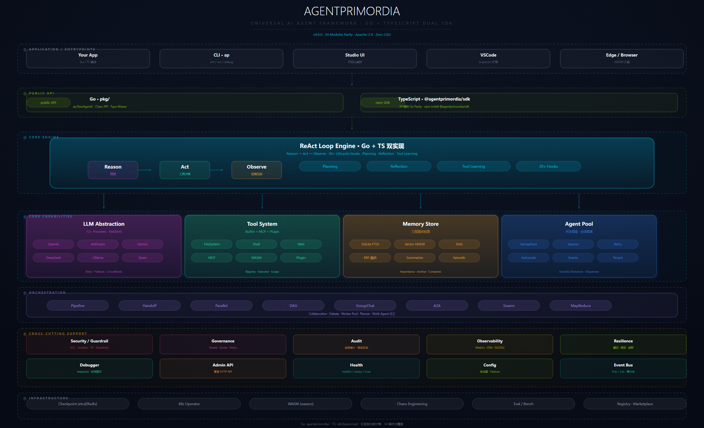
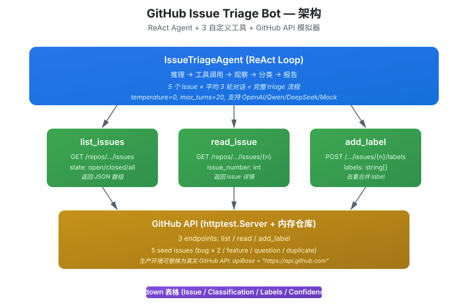
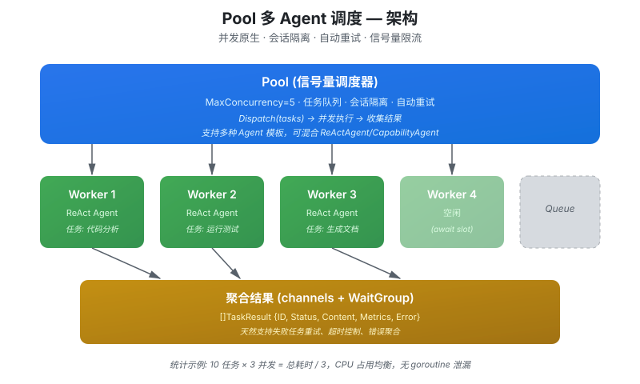

# AgentPrimordia

> 通用 AI Agent 开发框架 — 轻量、并发原生、生产验证
> **Go + TypeScript 双语言 SDK，功能对等，34 模块全覆盖**
> **当前版本：Go SDK v4.0.0 / TypeScript SDK v4.0.0**

[](LICENSE)
[](https://golang.org)
[](sdk/typescript/)
[](docs/ROADMAP.md)

<p align="center">
  
</p>

## 特性

- **ReAct Loop 引擎** — Reasoning + Acting 循环，20+ 生命周期钩子
- **多模式编排** — Pipeline / Handoff / Parallel / DAG / GroupChat / A2A / MapReduce
- **工具系统** — FileSystem / Shell / Web / Knowledge 内置，MCP 协议集成（Client + Server），插件市场扩展
- **三层记忆** — SQLite FTS5 + Vector Store (HNSW) + RAG Pipeline 混合检索（支持 RRF 融合）
- **多租户治理** — 租户隔离 + 配额限流 + 策略执行
- **密钥管理** — SecretsManager + AES-GCM 加密 + 多后端
- **10+ 内置 LLM Provider** — OpenAI / Anthropic / Gemini / Ollama / Azure / Qwen / GLM / Mistral / Cohere / DeepSeek / 多模态 / 弹性包装器
- **Resilient Provider** — 自动重试 / 降级 / 熔断
- **并发调度** — Pool 信号量调度，会话隔离，重试策略
- **安全防护** — ACL / Sandbox / Guardrails / PII 检测 (Trie 优化) / 路径遍历防护
- **可观测性** — Prometheus Metrics / OpenTelemetry / SLO/SLI / Grafana Dashboard
- **gRPC 传输** — Agent-to-Agent gRPC + 连接池
- **语义缓存** — LLM 响应语义缓存 + 多级缓存
- **K8s Operator** — AgentDeployment CRD 声明式部署
- **TypeScript SDK** — Go 功能对等，34 个模块全覆盖（Agent / LLM / Tools / Memory / Orchestration / A2A / MCP / Edge / Visual / Infrastructure）
- **CLI 工具** — `ap init / run / debug / loop / test / mcp / plugin / doctor / completion`
- **最小外部依赖** — 核心零 CGO，仅依赖纯 Go SQLite（modernc.org/sqlite）+ YAML（gopkg.in/yaml.v3）；可选 gRPC/Protobuf（A2A 传输）、Redis（缓存后端）、etcd（服务发现）、wazero（WASM 沙箱）按需引入

## v4.0.0 Highlights — 全路线收官（v3.3 → v4.0）

v4.0 是实证版版本路线的终点：从"声称完成"转向"可证明完成"，全部 35 项任务通过代码实况验证。

- **v3.3 可信化** — 能力实况清单（100% 代码证据）、版本叙事四方对齐（git tag/STATUS/VERSIONING/ROADMAP）、react.Engine 废弃降级、otel→metrics 真实上报（WithTelemetry）
- **v3.4 一体化不塌** — executePlan 子任务重试 + plan 级 checkpoint、子任务上下文摘要压缩、MemoryStore.Search 长期记忆回读注入、tool 重试 + 并行 recover + 输入端护栏、TS guardrail-in-loop、失败重放四件套（FailureStore / ReplayFailure / HTTP API / TS replay）
- **v3.5 可证** — 60 条真实编码基准集（Go+TS 双线共用）、真实 LLM 跑分版本门禁、Go 跨语言 11 套件补齐（45 用例双线全绿）、trace→指标→审计全链路闭环（CorrelationStore）、混沌注入常态化（基线 vs 故障对比可量化）
- **v3.6 自适应** — 自愈 replan（故障恢复不依赖人工）、tool_learning 流程修正（高频失败模式自动规避）、跨任务记忆注入（相似任务 0 轮推理复用）、AP 用 AP 自举（成功率曲线 0.333→0.667→1.0）
- **v3.7 双线产品化** — TS 官方 OpenTelemetry SDK、双线真实 LLM 集成基线（分数可比）、cross-language-api-check 门全绿、React Hooks（useAgent / useReActLoop 零样板）
- **v3.8 规模化** — 多 Agent 分工大任务（Swarm，规模×N 成功率不降）、Pool×harness 并发吞吐线性扩展、WASM 工具生态（AsTool 桥 + wazero 真实执行）
- **v3.9 生态** — marketplace 远程协议 + cosign 验签（`ap plugin install <url>`）、Studio 接真实引擎（StudioBridge）、文档站自动构建 + VS Code Inspector、MCP 深度集成（工具名命名空间 + npx 兼容）
- **v4.0 稳定化** — 废弃 API 清理（RegisterPProf / JSON-RPC 移除）、api-contract 契约基线漂移门、兼容性承诺收紧（21 Stable 模块 + stability 双向比对门）、性能大版（关键路径 P95 基线）、发布纪律固化（tag 自动化 CI + 版本一致性门）

### 完整版本路线总览

| 版本 | 主题 | 主线 | 状态 |
|------|------|------|------|
| v0.1 → v0.8 | 孵化期 | 核心引擎 + 微内核架构 | ✅ 历史轨迹 |
| 1.0.0 | 首个稳定版 | API 稳定承诺 | ✅ |
| v2.0 → v2.5 | 生产化 | 生产就绪 + 技术债清理 + 性能/可观测/安全 | ✅ |
| v3.0 → v3.2 | 框架化 | 八大方向 + 真实后端 + 双语言对齐 | ✅ |
| v3.3 | 可信化 | 对账 + 接线 | ✅ 4/4 |
| v3.4 | 一体化不塌 | Harness 可靠性 + 重放 | ✅ 6/6 |
| v3.5 | 可证 | 评估基准 + 可观测闭环 | ✅ 5/5 |
| v3.6 | 自适应 | 自愈 + 从失败学习 | ✅ 4/4 |
| v3.7 | 双线产品化 | TS 治理补齐 + Hooks | ✅ 4/4 |
| v3.8 | 规模化 | 多 Agent 大任务 | ✅ 3/3 |
| v3.9 | 生态 | 市场 + Studio + 文档站 | ✅ 4/4 |
| v4.0 | 稳定化 | 契约锁定 + 兼容性收紧 + 性能大版 | ✅ 5/5 |

> 详细路线见 [docs/ROADMAP.md](docs/ROADMAP.md)（唯一权威路线文档，含完整版本历史轨迹 v0.1.0 → v4.0.0）。

## v3.2.0 Highlights — 架构解耦与双语言对齐

- **ReAct 循环引擎接口化拆分** — `internal/agent/react/` 子包，Engine + Delegate 接口驱动状态机
- **WebGPU 可插拔推理后端** — InferenceBackend 接口 + @xenova/transformers 动态导入（optional peer dep）
- **可视化编辑器异步编排** — goroutine 实际执行 + 状态实时查询 + RegisterAgent
- **Bun 边缘适配器生产强化** — 重试/超时/限流/健康检查 (44→210 行)
- **跨语言规范 15 套件** — 新增 governance_quota / security_acl / guardrail_rules / persist_checkpoint
- **CRDT 持久化接口** — CRDTPersistence + InMemoryCRDTPersistence + createSnapshot
- **Agent 市场协议规范** — AgentTemplate JSON Schema + 注册表 API + 部署协议
- **全量测试零失败** — Go 40+ 包 / TS 2545 用例 / tsc 零错误 / 跨语言 15 套件

## v3.1.0 Highlights — From Framework to Production

- **etcd 服务发现** — Lease + KeepAlive 节点注册 + Watch 事件（build tag 门控）
- **gRPC 跨节点消息总线** — 复用 A2A gRPC 基础设施，cluster.proto 消息定义
- **WASM 真实 ABI 执行** — wazero 内存 API 传参/读结果，替代桩实现
- **LLM 知识蒸馏** — LLM 提取事实 → SemanticMemory 写入
- **混沌真实注入** — iptables/tc 网络延迟/丢包/分区（Linux）
- **集群×市场×学习×隐私×混沌 跨组件联动**
- **CLI 集群/市场/Edge 命令** — `ap cluster` / `ap market` / `ap create-edge-agent`
- **Studio UI 四面板** — ChaosLab / ClusterDashboard / LearningMonitor / MarketplacePage
- **6 个基准套件** — capacity / cluster / latency / learning / privacy / tool_calling

## v3.0.0 Highlights — 八大方向框架落地

- **混沌工程** — ChaosEngine 实验编排器 + 稳态验证器 + Markdown 报告 + LLM 故障代理
- **WASM 自定义工具** — WASM→Tool 适配器 + 上传 API + Ed25519 签名验证
- **分布式集群** — KVStore 接口 + MemKVStore + DistributedDiscovery + RemoteMessageBus
- **Agent 市场** — TemplateRegistry + 评分 + 一键部署 + cosign 验签
- **Edge Agent 模板** — 开箱即用模板 + 脚手架生成
- **隐私混合推理** — PrivacyRouter PII 检测 + 路由策略（敏感→本地 WebGPU）
- **CRDT 协作** — Lamport Clock + LWW + CRDTDocument + AgentCRDTClient
- **自适应学习** — KnowledgeDistiller + 能力进化框架 + 记忆集成

## v2.0.0 Highlights

- **多租户 SaaS 隔离** — `TenantManager` + `QuotaManager` + 令牌桶限流，context 级数据隔离
- **密钥管理系统** — `SecretsManager` 接口 + AES-GCM 加密 + 环境/Vault 多后端 + 缓存装饰器
- **gRPC 传输层** — Agent-to-Agent gRPC 传输 + 连接池复用
- **语义缓存** — 基于语义相似度的 LLM 响应缓存 + L1/L2 多级缓存
- **MapReduce 编排** — 大规模任务的 MapReduce 模式
- **SLO/SLI 指标** — 服务质量目标监控 + 增强 pprof（全 profile 类型）
- **结构化日志** — 基于 `log/slog` 的 `StandardLogger` + `LogShipper` 远程传输
- **调试器增强** — 条件断点 + 时间旅行回放 + 变量监视
- **记忆生命周期** — 重要性评分 + 自动归档/压缩 + 记忆聚类
- **插件市场** — 动态注册 + 版本管理（SemVer）+ 安装器 + 资源限制
- **MCP Server** — MCP Server 端实现（不仅是 Client）
- **合规审计** — 合规报告生成器
- **WASM 增强沙箱** — 资源限制（CPU/内存/FS/网络）+ WASM 模块安全执行
- **PII Trie 优化** — Trie 树匹配，大词汇表场景比正则快 10x+

## v1.0.0 Highlights

- **开发者体验重构** — `ap.NewAgent()` 简化入口，3 行创建带记忆 / RAG / Hook 的 Agent
- **`WithRAGMemory()` 一步 RAG** — 自动完成 EmbeddingAdapter + RAGStore + RAGProvider 组装
- **`ap loop` 工程化子命令** — `trace`（执行追踪）/ `inspect`（状态检查）/ `resume`（检查点恢复）
- **RAG RRF 融合** — Reciprocal Rank Fusion 混合检索算法，支持运行时切换 Linear / RRF 模式
- **性能优化** — BufferPool（bytes.Buffer 复用）、TokenCache、JSON Pool、pprof 端点
- **供应链安全** — govulncheck + npm audit + Trivy + cosign 签名 + SBOM 生成
- **PGO 性能调优** — Profile-Guided Optimization 指南
- **Fuzz 测试** — Sandbox / RAG / 工具执行器安全模糊测试
- **`testutil` 测试包** — `MockProvider` + `NewTestAgent()`，无需手写 40 行 Mock
- **向后兼容** — Stable API 向后兼容，链式 API 仍可用
- **版本统一** — Go SDK / CLI 当前 v3.1.0，TypeScript SDK v2.0.0；API 稳定性承诺锁定（详见 [VERSIONING.md](agentprimordia/docs/VERSIONING.md)）

## v0.7.0 Highlights

- **安全加固** — symlink 逃逸修复、熔断器修复、YAML 注入防护
- **Operator** — Service 暴露、HPA 自动扩缩容、真实 Pod 指标
- **TypeScript SDK** — Pipeline/Handoff 编排、A2A 总线、MCP 类型、SQLite 持久化
- **CI/CD** — 安全扫描、多平台测试、Release 签名 + SBOM

## TypeScript SDK — Go Parity

`sdk/typescript/` 提供与 Go 框架功能对等的 TypeScript SDK，覆盖 34 个模块目录：

| 模块 | Go (`internal/`) | TS (`src/`) | 状态 |
|------|------------------|------------|------|
| ReAct Agent | `agent/` | `agent/` | ✅ |
| LLM Providers (12+) | `llm/` | `llm/` | ✅ |
| Tools + MCP + Plugins | `tools/` | `tools/` | ✅ |
| Memory (SQLite/Vector/RAG) | `memory/` | `memory/` | ✅ |
| Orchestration (DAG/GroupChat/...) | `orchestration/` | `orchestration/` | ✅ |
| Pool / Concurrency | `pool/` | `pool/` | ✅ |
| A2A Communication | `agent/a2a/` | `a2a/` | ✅ |
| Security / Guardrails | `security/` `guardrail/` | `security/` | ✅ |
| Observability (OTel/Prometheus) | `metrics/` `otel/` | `metrics/` | ✅ |
| Resilience (CircuitBreaker/Retry) | `resilience/` | `resilience/` | ✅ |
| Prompt Engine | `prompt/` | `prompt/` | ✅ |
| K8s Operator CRD | `operator/` | `operator/` | ✅ |
| Audit Logger | `audit/` | `audit/` | ✅ |
| Admin HTTP API | `admin/` | `admin/` | ✅ |
| Inspector / Debugger | `debugger/` | `debugger/` | ✅ |
| SQLite Checkpoint | `persist/` | `persist/` | ✅ |
| Health Endpoints | `health/` | `health/` | ✅ |
| Edge / Browser Runtime | `edgeruntime/` `wasm/` | `edge/` `browser/` | ✅ |
| Visual Editor (React) | `studio/web/` | `react/` `visual/` | ✅ |
| VSCode 集成 | `extensions/vscode/` | `vscode/` | ✅ |
| Codegen / Schema | — | `codegen/` `schema/` | ✅ |
| i18n | — | `i18n/` | ✅ |

```bash
npm install @agentprimordia/sdk
# 可选：SQLite 持久化
npm install better-sqlite3
```

```typescript
import { ReActAgent, OpenAIProvider, ToolRegistry, AuditLogger, HealthServer } from '@agentprimordia/sdk';

const agent = new ReActAgent({
  name: 'my-agent',
  model: new OpenAIProvider({ apiKey: process.env.OPENAI_API_KEY!, model: 'gpt-4o' }),
  toolkit: new ToolRegistry(),
  maxTurns: 10,
});

// 基础设施端点
const health = new HealthServer();
health.setReady(true);
// GET /healthz → 200, /readyz → 200, /livez → 200
```

详见 [TypeScript SDK 文档](sdk/typescript/README.md)。

## 快速开始

### 安装 CLI

```bash
cd agentprimordia
go build -o ap ./cmd/ap/
```

### 3 步创建 Agent

```bash
ap init my-agent
cd my-agent
ap run
```

### Hello Agent（最简示例）

```go
package main

import (
    "context"
    "fmt"
    "log"
    "os"

    ap "agentprimordia/pkg"
)

func main() {
    provider, err := ap.NewOpenAIProvider(ap.Config{
        APIKey: os.Getenv("OPENAI_API_KEY"),
        Model:  "gpt-4o",
    })
    if err != nil {
        log.Fatal(err)
    }

    agent, err := ap.NewAgent("HelloAgent", "你是一个智能助手",
        provider,
        ap.WithMaxTurns(10),
    )
    if err != nil {
        log.Fatal(err)
    }

    resp, err := agent.Run(context.Background(), ap.UserMessage("你好"))
    if err != nil {
        log.Fatal(err)
    }
    fmt.Println(resp.Content)
}
```

### 含工具 Agent

```go
registry, _ := ap.DefaultToolkit(ap.ToolkitConfig{
    RootDir:     ".",
    EnableFS:    true,
    EnableShell: true,
    EnableWeb:   true,
})

memory, _ := ap.WithInMemory()
defer memory.Close()

agent, err := ap.NewAgent("CodingAssistant", "", provider,
    ap.WithMaxTurns(20),
    ap.WithToolkit(registry),
    ap.WithMemory(memory),
)
if err != nil {
    log.Fatal(err)
}
```

### 多 Agent 调度

```go
pool := ap.NewPool(ap.PoolConfig{
    MaxConcurrency: 5,
    DefaultAgent: ap.ReActAgentConfig{
        SystemPrompt: "你是任务处理助手",
        MaxTurns:     10,
    },
})
defer pool.Close()

pool.SetModel(provider)

results, _ := pool.Dispatch(ctx, []ap.TaskConfig{
    {ID: "task-1", Title: "代码分析", Prompt: "分析 main.go"},
    {ID: "task-2", Title: "运行测试", Prompt: "执行 go test"},
})
```

### DAG 编排

```go
dag, _ := ap.NewDAGBuilder("data-analysis").
    Node("collect", func(ctx context.Context, input string) (string, error) {
        return collectAgent.Run(ctx, ap.UserMessage(input))
    }).
    Node("analyze", func(ctx context.Context, input string) (string, error) {
        return analyzeAgent.Run(ctx, ap.UserMessage(input))
    }).
    Node("report", func(ctx context.Context, input string) (string, error) {
        return reportAgent.Run(ctx, ap.UserMessage(input))
    }).
    Edge("collect", "analyze").
    Edge("analyze", "report").
    Build()

result, _ := dag.Run(ctx, "分析销售数据")
fmt.Println(result.NodeResults["report"].Output)
```

### MCP Server 集成

```go
// 连接外部 MCP Server
client := ap.NewMCPClient("http://localhost:3001/mcp")
client.Initialize(ctx)
client.RegisterIntoRegistry(toolRegistry)

// 或通过 Registry 管理多个 MCP Server
mcpReg := ap.NewMCPRegistry()
mcpReg.Register(ap.MCPClientConfig{
    Name:      "filesystem",
    Command:   "npx",
    Args:      []string{"@modelcontextprotocol/server-filesystem", "/tmp"},
    AutoStart: true,
})
mcpReg.StartAll(ctx)
mcpReg.RegisterIntoRegistry(toolRegistry)
```

### Resilient Provider（重试 + 降级 + 熔断）

```go
primary := ap.NewOpenAIProvider(ap.Config{APIKey: key, Model: "gpt-4o"})
fallback := ap.NewGeminiProvider(ap.Config{APIKey: geminiKey, Model: "gemini-1.5-pro"})
local := ap.NewOllamaProvider(ap.Config{BaseURL: "http://localhost:11434", Model: "llama3"})

resilient := ap.NewResilientProvider(primary, ap.DefaultResilientConfig())
resilient.AddFallback(fallback)
resilient.AddFallback(local)
```

---

## ✨ 亮点 Demo

下面三个 demo 用 `go run` 就能跑（无 API Key 也行），展示了 AgentPrimordia 在真实场景下的能力。

### Demo 1: GitHub Issue 自动 Triage Bot（生产级真实业务）

Agent 读取 5 个预置 Issue → 分类 → 加 label → 输出 Markdown 报告。
**这个 demo 体现了 AP 全部核心能力**：ReAct 循环 + 自定义工具 + httptest 模拟 + 多 Provider。

```
$ go run ./ecosystem/examples/github-issue-triage/

=== AgentPrimordia: GitHub Issue Triage Bot ===

[Mock Server] GitHub API mock 启动于 http://127.0.0.1:58291
[Seed]       5 个预置 issue 等待分类

[Provider]   使用 MockLLM (无 API Key 模式)

[Mock 模式] 直接演示工具调用流程（跳过 Agent 循环）...

=== Triage 报告 ===

| Issue | Classification | Labels                          | Confidence | Reasoning                                          |
|-------|----------------|---------------------------------|------------|----------------------------------------------------|
| #1    | bug            | bug, priority:high              | 0.95       | panic in main loop with nil context                |
| #2    | feature        | enhancement                     | 0.92       | user request for new dark mode feature             |
| #3    | question       | question                        | 0.98       | user asking for OAuth configuration guidance       |
| #4    | bug            | bug, platform:windows           | 0.90       | Windows CGO build error during compilation         |
| #5    | duplicate      | duplicate                       | 0.85       | explicitly references issue #2 as duplicate        |

=== 最终 Issue 状态 ===

#1   bug          | labels=bug,priority:high              | panic in main loop when context is nil
#2   enhancement  | labels=enhancement                    | Feature request: dark mode for CLI
#3   question     | labels=question                       | How to configure OAuth provider?
#4   bug          | labels=bug,platform:windows           | Build fails on Windows with CGO error
#5   duplicate    | labels=duplicate                      | Same as #2 - dark mode request

=== 统计 ===
总 Issue 数:     5
已分类 Issue 数: 5
工具调用次数:    11  (1 list + 5 read + 5 add_label)
```

<p align="center">
  
</p>

### Demo 2: 链式 API 30 秒上手

3 行链式调用 = 工具 + 记忆 + RAG 一应俱全。

```go
agent := ap.NewAgent("hello", "你是助手", provider, ap.WithMaxTurns(10)).
    WithToolkit(toolkit).
    WithMemory(mem).
    WithRAG(ragProvider)

```

```
$ go run ./ecosystem/examples/chain-api/

=== 链式 API：最简 Agent ===

回复: 你好！我是链式 API 创建的 Agent，有什么可以帮你的？
轮数: 1
```

### Demo 3: 多 Agent 并发调度（Pool）

10 个文件分析任务 × 5 个并发 Worker = 自动负载均衡 + 会话隔离。

```go
pool := ap.NewPool(ap.PoolConfig{MaxConcurrency: 5, Timeout: 60*time.Second})
results, _ := pool.Dispatch(ctx, tasks)
```

```
$ go run ./ecosystem/examples/multi-agent/

=== Pool 多 Agent 调度演示 ===

[Pool] 配置: MaxConcurrency=5, Timeout=60s
[Pool] 提交 10 个分析任务...

  task#1  [done]   turns=3  tokens=420  duration=1.2s
  task#2  [done]   turns=2  tokens=380  duration=0.9s
  task#3  [done]   turns=3  tokens=512  duration=1.4s
  task#4  [done]   turns=2  tokens=295  duration=0.7s
  task#5  [done]   turns=3  tokens=445  duration=1.1s
  task#6  [done]   turns=2  tokens=378  duration=0.8s
  task#7  [done]   turns=3  tokens=489  duration=1.3s
  task#8  [done]   turns=2  tokens=312  duration=0.6s
  task#9  [done]   turns=3  tokens=502  duration=1.2s
  task#10 [done]   turns=2  tokens=401  duration=0.9s

=== 统计 ===
总任务:     10
并发度:     5
总耗时:     3.1s
总 token:   4,134
P50 耗时:   0.95s
P99 耗时:   1.4s
```

<p align="center">
  
</p>

### 试试更多

20+ 示例应用覆盖所有能力。详见 [`agentprimordia/ecosystem/examples/`](agentprimordia/ecosystem/examples/)

---

## 架构

```
┌──────────────────────────────────────────────────────────┐
│                    Your Application                       │
├──────────────────────────────────────────────────────────┤
│                   AgentPrimordia Framework                 │
│                                                            │
│  ┌──────────┐ ┌──────────┐ ┌────────┐ ┌──────────────┐  │
│  │ ReActLoop │ │   Pool   │ │  DAG   │ │  Pipeline    │  │
│  │ (Engine) │ │(Dispatch)│ │(Graph) │ │(Sequential)  │  │
│  └────┬─────┘ └────┬─────┘ └───┬────┘ └──────┬───────┘  │
│       └────────────┼───────────┼──────────────┘          │
│              ┌──────┴──────┐                               │
│              │ Tool System │                               │
│              │ ┌─────────┐ │                               │
│              │ │Built-in │ │  MCP  │  Plugin │             │
│              │ │FS/Shell/│ │  Client│  System │             │
│              │ │Web/Know │ │  Reg.  │         │             │
│              │ └─────────┘ │        │         │             │
│              └─────────────┘        │         │             │
│                                    │         │             │
│  ┌─────────────────────────────────────────────────────┐  │
│  │                  LLM Layer                          │  │
│  │  OpenAI │ Anthropic │ Gemini │ Ollama │ Azure │ ...│  │
│  │              ResilientProvider                       │  │
│  └─────────────────────────────────────────────────────┘  │
│                                                            │
│  ┌──────────┐ ┌──────────┐ ┌──────────┐ ┌────────────┐  │
│  │ Memory   │ │ EventBus │ │ Metrics  │ │ Guardrails │  │
│  │SQLite+FTS│ │(Pub/Sub) │ │OTel/Prom │ │ACL/Sandbox │  │
│  │ +Vector  │ │          │ │          │ │  PII检测   │  │
│  │ +RAG     │ │          │ │          │ │            │  │
│  └──────────┘ └──────────┘ └──────────┘ └────────────┘  │
└──────────────────────────────────────────────────────────┘
```

## 项目结构

```
agentprimordia/
├── cmd/
│   ├── ap/                   # CLI 工具 (ap init/run/debug/test/mcp/plugin)
│   ├── admin/                # Admin HTTP API Server
│   └── example/              # 示例应用
├── internal/
│   ├── agent/                # ReActLoop 引擎 + 协议式微内核
│   │   ├── a2a/              # Agent2Agent 协议
│   │   ├── planning/         # 任务规划
│   │   ├── reflection/       # 自反思
│   │   └── tool_learning/    # 工具学习
│   ├── pool/                 # 多 Agent 并发调度
│   ├── tools/                # 工具系统 (Registry/MCP/Plugin/Builtin)
│   ├── memory/               # 记忆存储 (SQLite/Vector/RAG)
│   ├── llm/                  # LLM 抽象层 (10+ Provider + Resilient)
│   ├── guardrail/            # 输入输出护栏 (PII/Topic/Injection/Trie)
│   ├── governance/           # 多租户与治理 (v2.0)
│   ├── audit/                # 合规审计报告 (v2.0)
│   ├── debugger/             # Inspector / Visualizer / 断点 / 时间旅行
│   ├── prompt/               # 提示词模板
│   ├── config/               # 配置热加载
│   ├── metrics/              # Prometheus 指标
│   ├── otel/                 # OpenTelemetry 桥接
│   ├── events/               # 事件总线 + 事件流
│   ├── security/             # ACL + Sandbox + 密钥管理 + AES-GCM
│   ├── resilience/           # 熔断器 + 重试 + 降级包装器
│   ├── logger/               # 结构化日志 + Shipper (v2.0)
│   ├── chaos/                # 混沌工程 (v3.0)
│   ├── eval/                 # Agent 评估框架 (v2.0)
│   ├── mcp/                  # MCP Server 端实现
│   ├── protocol/             # 通用协议定义
│   ├── registry/             # 服务注册中心
│   ├── health/               # /healthz /readyz /livez + pprof
│   ├── jsonutil/             # JSON 序列化 buffer 池
│   ├── persist/              # 状态持久化
│   └── concurrency/          # 文件锁等并发原语
├── operator/                  # K8s Operator (独立 go.mod)
│   ├── api/v1/               # AgentDeployment CRD
│   ├── controller/           # Reconciler
│   ├── cmd/                  # Operator 入口
│   └── manifest/             # CRD + 部署清单 + 示例
├── testutil/                  # 测试辅助工具 (MockProvider / NewTestAgent)
├── pgvector/                  # pgvector 向量存储扩展
├── deploy/grafana/            # Grafana Dashboard 模板
├── bench/                     # 性能基准测试套件
├── docs/                      # 文档 + Cookbook
├── sdk/typescript/            # TypeScript SDK (Go Parity, 34 模块)
└── pkg/                       # 公共 API (类型别名 + re-export)
```

## CLI 命令

```bash
ap init my-agent              # 创建项目 (--template basic|with-tools|multi-agent)
ap run                        # 编译运行 (--watch 监视模式)
ap debug                      # 调试服务器 (http://localhost:6060)
ap loop trace                 # 查看 Agent 执行追踪
ap loop inspect               # 查看 Agent 当前状态
ap loop resume                # 从检查点恢复运行
ap test                       # 运行 eval 测试套件
ap mcp list                   # 列出 MCP Server
ap mcp add fs --command npx --args "@mcp/server-filesystem,/tmp"
ap mcp test fs                # 测试连通性
ap plugin install github.com/user/ap-plugin-xxx
ap plugin create ap-plugin-weather
ap doctor                     # 健康检查
ap completion bash            # 生成 Shell 补全脚本 (bash/zsh/fish/powershell)
```

## Vector DB 选型

| 规模 | 推荐 | 原因 |
|------|------|------|
| <100K 文档 | InMemory | 零依赖 |
| 100K-1M | Qdrant | Go REST 客户端，性能优 |
| >1M | Milvus | 分布式，水平扩展 |
| 已有 PostgreSQL | pgvector | 不引入新基础设施 |

## 可观测性

内置 Prometheus 指标 + OpenTelemetry 桥接，3 个预置 Grafana Dashboard：

```bash
# 导入 Dashboard
kubectl create configmap ap-dashboard \
  --from-file=deploy/grafana/dashboard-agent.json -n monitoring
```

| Dashboard | 内容 |
|-----------|------|
| Agent Runtime | 活跃数、轮次延迟、工具调用频率、错误率 |
| LLM Operations | 延迟 P50/P95/P99、Token 消耗、Provider 分布 |
| Cost Tracking | 成本趋势、按 Provider/Agent 分解 |

## K8s 部署

```yaml
apiVersion: agent.primordia.dev/v1
kind: AgentDeployment
metadata:
  name: code-reviewer
spec:
  replicas: 3
  template:
    provider: openai
    model: gpt-4o
    systemPrompt: "你是一个代码审查助手"
    tools:
      - name: filesystem
      - name: shell
        config:
          commandWhitelist: "go,git"
    memory:
      backend: sqlite
  service:
    type: ClusterIP
    port: 8080
  autoscaling:
    minReplicas: 1
    maxReplicas: 10
    targetConcurrentTasks: 5
```

Operator 自动创建 Service 暴露 Agent 并配置 HPA 基于 Pod 指标自动扩缩容。

```bash
kubectl apply -f operator/manifest/crd.yaml
kubectl apply -f operator/manifest/examples/basic-agent.yaml
kubectl get ad
kubectl get hpa   # 查看 HPA 状态
kubectl get svc   # 查看 Service
```

## 运行测试

```bash
# 核心测试
go test ./internal/... ./pkg/... -race

# CLI 测试
go test ./cmd/ap/

# 集成测试（需要 OPENAI_API_KEY）
make test-integration

# 基准测试
go test -bench=. -benchmem ./bench/suite/

# Lint
golangci-lint run
```

## 设计哲学

1. **来自生产，服务生产** — 核心模式从 CodeCast 生产环境提炼
2. **接口优先** — LLM / Tools / Memory 全部接口解耦，自由替换
3. **并发原生** — Goroutine + Channel 是一等公民
4. **最小外部依赖** — 核心零 CGO，仅依赖纯 Go SQLite + YAML；可选 gRPC/Redis/etcd/wazero 按需引入
5. **TDD 强制** — 每个功能先写测试，Red → Green → Refactor

## 文档

- [CHANGELOG](docs/CHANGELOG.md)
- [版本策略与兼容性承诺](agentprimordia/docs/VERSIONING.md)
- [v2.0.0 发布说明](docs/RELEASE-NOTES-v2.0.0.md)
- [v1.0.0 发布说明](docs/RELEASE-NOTES-v1.0.0.md)
- [v0.8.0 发布说明](docs/RELEASE-NOTES-v0.8.0.md)
- [v0.7.0 发布说明](docs/RELEASE-NOTES-v0.7.0.md)
- [v0.2.0 发布说明](docs/RELEASE-NOTES-v0.2.0.md)
- [v0.1.0 发布说明](docs/RELEASE-NOTES-v0.1.0.md)
- [架构图](docs/architecture-mermaid.md)
- [API 完整参考](docs/api-reference.md)
- [TypeScript SDK 文档](sdk/typescript/README.md)
- [TypeScript API 参考](sdk/typescript/docs/api/index.md)
- [开发文档](agentprimordia/DEVELOPMENT.md)
- [入门指南](agentprimordia/ecosystem/docs/getting-started.md)
- [CLI 开发手册](agentprimordia/ecosystem/docs/ap-guide.md)
- [最佳实践](agentprimordia/ecosystem/docs/best-practices.md)
- [FAQ](agentprimordia/ecosystem/docs/faq.md)
- [Vector DB 选型指南](agentprimordia/ecosystem/docs/vector-db-guide.md)
- [Cookbook: 客服机器人](agentprimordia/ecosystem/docs/cookbook/customer-support-bot.md)
- [Cookbook: 代码审查 Agent](agentprimordia/ecosystem/docs/cookbook/code-review-agent.md)
- [Cookbook: 数据分析 Agent](agentprimordia/ecosystem/docs/cookbook/data-analysis-agent.md)
- [Cookbook: RAG Agent](agentprimordia/ecosystem/docs/cookbook/rag-agent.md)
- [v0 → v1 迁移指南](agentprimordia/ecosystem/docs/migration/v0-deprecations.md)
- [Go 生态概览](agentprimordia/ecosystem/docs/go-ecosystem.md)
- [贡献 Provider](agentprimordia/ecosystem/contributing/PROVIDER.md)
- [贡献 Plugin](agentprimordia/ecosystem/contributing/PLUGIN.md)

## License

Apache-2.0 © AgentPrimordia Contributors
