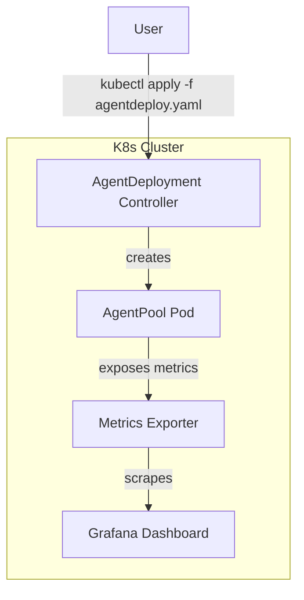

# K8s 部署完整指南

> 使用 AgentPrimordia Operator 在 Kubernetes 上部署 AgentPool。

## 架构



## 部署步骤

### 1. 安装 Operator

```bash
kubectl apply -f https://github.com/AgentPrimordia/operator/releases/latest/install.yaml
```

### 2. 创建 AgentDeployment

```yaml
# agent-deployment.yaml
apiVersion: agentprimordia.dev/v1
kind: AgentDeployment
metadata:
  name: my-agent-pool
spec:
  replicas: 3
  agent:
    name: production-agent
    systemPrompt: "你是生产环境助手。"
    maxTurns: 20
    llm:
      provider: openai
      model: gpt-4o
      apiKeySecret:
        name: llm-creds
        key: api_key
  pool:
    maxConcurrent: 10
    maxTasksPerMinute: 100
  resources:
    requests:
      cpu: "500m"
      memory: "512Mi"
    limits:
      cpu: "2"
      memory: "2Gi"
  monitoring:
    enabled: true
    prometheus:
      port: 9090
      path: /metrics
```

### 3. 部署

```bash
kubectl apply -f agent-deployment.yaml
kubectl get agentdeployments
kubectl logs -l app=my-agent-pool
```

### 4. 监控

```bash
# 查看 Prometheus 指标
kubectl port-forward svc/my-agent-pool-metrics 9090:9090
open http://localhost:9090/metrics
```

## 扩展

- **HPA 自动扩缩**：基于队列深度自动调整副本数
- **金丝雀发布**：逐步将流量切到新版本 Agent
- **多租户隔离**：每个租户独立 AgentPool + 配额
- **GPU 支持**：本地 LLM 推理需要 GPU 资源
