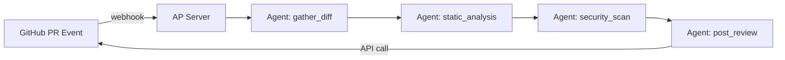

# 代码审查 Bot

> 自动拉取 GitHub PR、运行静态分析、生成审查评论。

## 背景

团队希望每次 GitHub PR 提交后自动触发 Agent 进行代码审查，检查安全漏洞、性能隐患、不符合最佳实践的模式，并在 PR 上留下 review comments。

## 架构



## 代码

```go
package main

import (
    "context"
    "fmt"
    "log"
    "os"

    ap "agentprimordia/pkg"
)

func main() {
    registry := ap.NewToolRegistry()
    registry.Register(ap.NewFileSystemTool(ap.FSToolConfig{ReadOnly: true}))
    registry.Register(ap.NewShellTool(ap.ShellToolConfig{Allowlist: []string{"gosec", "staticcheck", "gofmt"}}))
    registry.Register(ap.NewWebTool()) // GitHub API

    agent := ap.NewAgent(ap.AgentConfig{
        Name: "code-review-bot",
        SystemPrompt: `你是一个代码审查助理。
1. 用 shell 工具运行 gosec / staticcheck 扫描 PR diff
2. 用 GitHub API 提交 review 评论
3. 高风险问题标记 'REQUEST_CHANGES'
4. 中低风险标记 'COMMENT'`,
        Memory: ap.NewInMemoryMemory(),
        Tools:  registry.All(),
    })

    prURL := os.Getenv("PR_URL")
    resp, err := agent.Run(context.Background(), fmt.Sprintf("审查 PR: %s", prURL))
    if err != nil { log.Fatal(err) }
    fmt.Println(resp.Content)
}
```

## 配置

```yaml
name: code-review-bot
llm:
  provider: anthropic
  model: claude-sonnet-4-20250514
tools:
  - filesystem
  - shell
  - web
shell:
  allowlist: ["gosec", "staticcheck", "gofmt", "govet"]
guardrail:
  - type: pii_filter
  - type: prompt_injection
```

## 部署

```bash
# 作为 GitHub Actions 步骤运行
ap run --webhook :8080
```

## 扩展

- **增量审查**：只审查 diff 部分，而非整个文件
- **历史学习**：记忆团队过往审查偏好
- **安全扫描**：集成 govulncheck、Trivy
- **自动修复**：Agent 自动提交修复 patch
