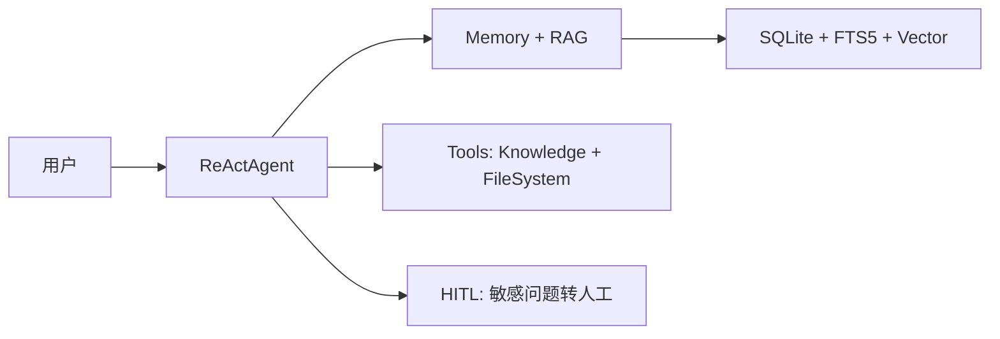

# Cookbook: 客服机器人

用 AgentPrimordia 构建一个具备知识库检索、对话记忆和人机协作的客服机器人。

## 场景

用户通过自然语言咨询产品问题，Agent 从知识库检索相关文档，结合历史对话记忆给出准确回复。遇到敏感问题（退款、投诉）时自动转交人工。

## 架构



## 完整代码

```go
package main

import (
	"context"
	"fmt"
	"log"
	"os"

	ap "agentprimordia/pkg"
)

func main() {
	// 1. 工具集：文件系统 + 知识库搜索
	registry, err := ap.DefaultToolkit(ap.ToolkitConfig{
		RootDir:  "./knowledge",
		EnableFS: true,
	})
	if err != nil {
		log.Fatal(err)
	}

	// 2. 记忆存储：SQLite 持久化
	memory, err := ap.NewSQLiteStore("./data/customer-support.db")
	if err != nil {
		log.Fatal(err)
	}
	defer memory.Close()

	// 3. Hook：敏感词检测 → HITL
	hooks := ap.NewHookManager()
	hooks.Register(ap.HookBeforeTool, func(ctx context.Context, hctx *ap.HookContext) error {
		fmt.Printf("[审计] 工具调用: %s\n", hctx.ToolCall.Name)
		return nil
	})

	// 4. 创建 Agent
	agent := ap.NewReActAgent(ap.ReActConfig{
		Name: "CustomerSupport",
		SystemPrompt: `你是一个客服助手。
- 先从知识库检索相关信息再回答
- 遇到退款、投诉等敏感问题，提示用户将转交人工处理
- 用中文回复，态度友好专业`,
		MaxTurns: 15,
		Model:    newProvider(),
		Toolkit:  registry,
		Memory:   ap.NewMemoryAdapter(memory),
		Hooks:    hooks,
	})

	// 5. 运行对话
	resp, err := agent.Run(context.Background(),
		ap.UserMessage("你们的退货政策是什么？"))
	if err != nil {
		log.Fatal(err)
	}

	fmt.Printf("回复: %s\n", resp.Content)
	fmt.Printf("工具调用: %d 次\n", resp.Metrics.TotalTools)
}

// 替换为真实 Provider
func newProvider() *ap.OpenAIProvider {
	return ap.NewOpenAIProvider(ap.Config{
		APIKey: os.Getenv("OPENAI_API_KEY"),
		Model:  "gpt-4o",
	})
}
```

## 关键 API

- `ap.NewSQLiteStore(path)` — 持久化记忆，重启后对话历史不丢失
- `ap.DefaultToolkit(ToolkitConfig{EnableFS: true})` — 启用文件系统工具让 Agent 可读取知识文档
- `ap.NewMemoryAdapter(memory)` — 将 Memory 接口适配为 Agent 所需的 MemoryStore
- `HookBeforeTool` — 工具调用前审计，可拦截敏感操作

## 扩展方向

1. **接入 RAG Pipeline** — 用 `ap.NewRetrievalAugmentedGenerator` 实现端到端检索+生成
2. **多轮对话** — 将 Agent 放入 HTTP 服务，循环接收用户输入，保持 session 隔离
3. **Guardrails** — 用 `ap.NewTopicRule` 过滤无关话题，限制 Agent 只回答产品相关问题
