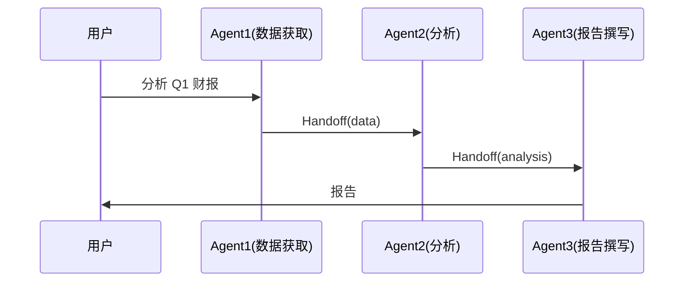

# 多 Agent 协作（Handoff 模式）

> 使用 Handoff 编排模式让多个 Agent 依次或并行处理任务。

## 背景

一个复杂任务（例如"分析市场数据并撰写报告"）可以拆分为多个子任务，每个子任务由专门的 Agent 负责。Handoff 模式Agent 完成自己的步骤后，通过 Handoff 将控制权交给下一个 Agent。

## 架构



## 代码

```go
package main

import (
    "context"
    "fmt"
    "log"

    ap "agentprimordia/pkg"
)

func main() {
    pool := ap.NewPool(ap.PoolConfig{MaxConcurrent: 4})

    // 注册三个专门 Agent
    pool.Register("fetcher", ap.AgentConfig{
        Name: "数据获取", SystemPrompt: "从公开API拉取数据，返回 JSON。",
    })
    pool.Register("analyst", ap.AgentConfig{
        Name: "数据分析师", SystemPrompt: "分析数据，提取关键指标。",
    })
    pool.Register("writer", ap.AgentConfig{
        Name: "报告撰写", SystemPrompt: "根据分析结果撰写 Markdown 报告。",
    })

    // 编排：Handoff Pipeline
    pipeline := ap.NewHandoffPipeline(pool, []string{"fetcher", "analyst", "writer"})

    result, err := pipeline.Execute(context.Background(), "分析 AgentPrimordia 在 GitHub 上的增长数据")
    if err != nil { log.Fatal(err) }

    fmt.Println(result.Content)
}
```

## 配置

```yaml
name: multi-agent-collab
llm:
  provider: openai
  model: gpt-4o
pool:
  max_concurrent: 4
agents:
  - name: fetcher
    system_prompt: "从公开API拉取数据，返回 JSON。"
  - name: analyst
    system_prompt: "分析数据，提取关键指标。"
  - name: writer
    system_prompt: "根据分析结果撰写 Markdown 报告。"
orchestration:
  mode: handoff
  pipeline: [fetcher, analyst, writer]
```

## 扩展

- **并行 Handoff**：多个 Agent 同时处理各自子任务（`mode: parallel`）
- **条件 Handoff**：基于中间结果动态选择下一个 Agent
- **检查点恢复**：任意 Agent 失败时从检查点重新启动
- **人机协作**：关键步骤插入 HITL（Human-in-the-Loop）审批
