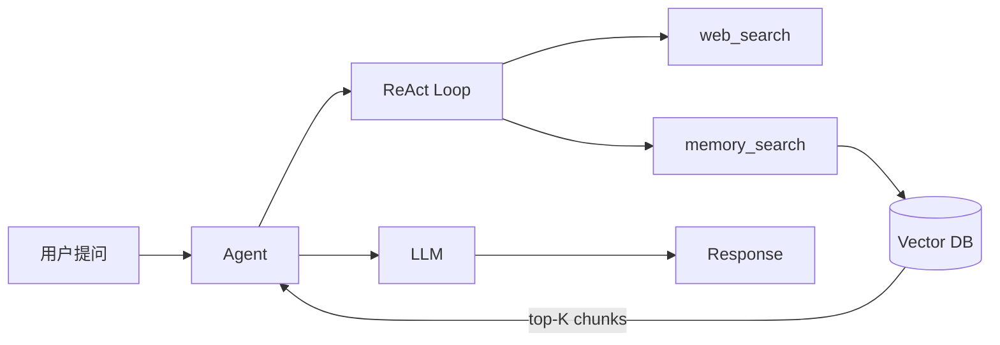

# RAG Agent 完整实现

> 构建一个带知识检索能力的 Agent：从文档加载、向量存储到检索增强生成（RAG）全流程。

## 背景

你有一批内部文档（Markdown / PDF），希望 Agent 在回答问题时能引用这些文档，而非仅依赖 LLM 的参数知识。

## 架构



## 代码

```go
// main.go
package main

import (
    "context"
    "fmt"
    "log"

    ap "agentprimordia/pkg"
)

func main() {
    // 1. 创建向量记忆后端
    mem, err := ap.NewVectorMemory(ap.VectorConfig{
        DBPath:   "./data/vectors.db",
        Embedder: ap.NewOpenAIEmbedder(), // 或本地 ONNX 嵌入
    })
    if err != nil { log.Fatal(err) }
    defer mem.Close()

    // 2. 加载文档到向量库
    docs, _ := ap.LoadDocuments("./knowledge")
    for _, d := range docs {
        _ = mem.Add(context.Background(), &ap.Episode{
            Content:  d.Content,
            Metadata: map[string]any{"source": d.Path},
        })
    }

    // 3. 创建 Agent
    agent := ap.NewAgent(ap.AgentConfig{
        Name:         "rag-agent",
        SystemPrompt: "你是知识助手。回答前先用 memory_search 检索相关文档。",
        MaxTurns:     10,
        Memory:       mem,
        Tools: []ap.Tool{
            ap.NewWebSearchTool(),
            ap.NewMemorySearchTool(mem),
        },
    })

    // 4. 运行
    resp, err := agent.Run(context.Background(), "AgentPrimordia 的插件系统如何工作？")
    if err != nil { log.Fatal(err) }
    fmt.Println(resp.Content)
}
```

## 配置

```yaml
# .ap.yaml
name: rag-agent
llm:
  provider: openai
  model: gpt-4o
memory:
  backend: vector
  path: ./data/vectors.db
  embedder:
    type: openai
    model: text-embedding-3-small
agent:
  max_turns: 10
  system_prompt: |
    你是知识助手。回答前先用 memory_search 检索相关文档。
    引用文档时标注来源。
tools:
  - web_search
  - memory_search
```

## 运行

```bash
# 准备知识库
mkdir -p knowledge
echo "AgentPrimordia 插件系统基于 Go plugin 模式..." > knowledge/plugins.md

# 启动
export AP_LLM_API_KEY=sk-xxx
ap run
```

## 扩展

- **混合检索**：结合关键词（BM25）与向量检索，提升召回率
- **重排序**：使用 cross-encoder 对 top-K 结果二次排序
- **引用生成**：在答案中插入 `[source:plugins.md#L12]` 格式引用
- **增量更新**：监听文件变更事件，自动重建向量索引
