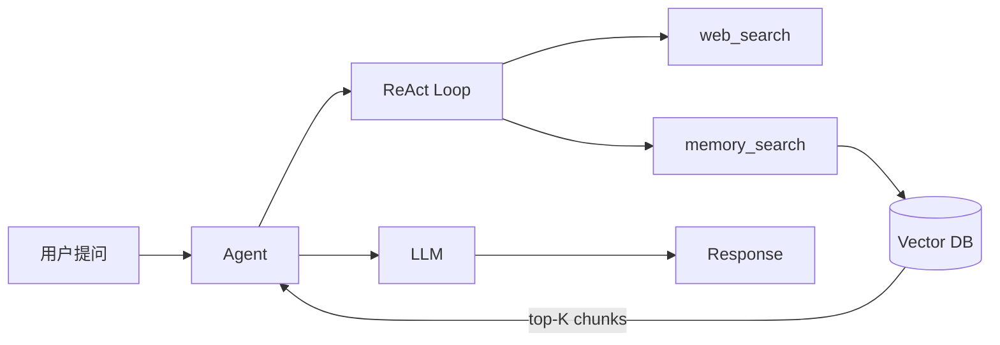

# RAG Agent 完整实现

> 构建一个带知识检索能力的 Agent：从文档加载、向量存储到检索增强生成（RAG）全流程。

## 背景

你有一批内部文档（Markdown / PDF），希望 Agent 在回答问题时能引用这些文档，而非仅依赖 LLM 的参数知识。

## 架构



## 代码

```go
// main.go
package main

import (
    "context"
    "fmt"
    "log"
    "os"
    "path/filepath"

    ap "agentprimordia/pkg"
)

func main() {
    ctx := context.Background()

    // 1. 创建 LLM Provider
    provider, err := ap.NewOpenAIProvider(ap.Config{
        APIKey: os.Getenv("OPENAI_API_KEY"),
        Model:  "gpt-4o",
    })
    if err != nil {
        log.Fatal(err)
    }

    // 2. 创建 SQLite 记忆存储
    mem, err := ap.NewSQLiteStore("./data/memory.db")
    if err != nil {
        log.Fatal(err)
    }
    defer mem.Close()

    // 3. 创建 Embedding 适配器（将 LLM Provider 适配为 EmbeddingProvider）
    embedder := ap.NewEmbeddingAdapter(provider, 1536)

    // 4. 创建 RAG Store（FTS5 + 向量混合检索）
    ragStore := ap.NewRAGStore(mem, embedder)

    // 5. 加载文档到记忆库
    files, _ := filepath.Glob("./knowledge/*.md")
    for _, f := range files {
        content, _ := os.ReadFile(f)
        _ = mem.Add(ctx, &ap.Episode{
            SessionID: "knowledge",
            Role:      "system",
            Content:   string(content),
            Metadata:  map[string]string{"source": f},
        })
    }

    // 6. 创建 Agent
    agent, err := ap.NewAgent("rag-agent", "你是知识助手。回答时引用文档来源。",
        provider,
        ap.WithMaxTurns(10),
        ap.WithMemory(mem),
        ap.WithRAG(ap.RAGConfig{
            Provider: ragStore,
            Mode:     ap.RAGModeAuto, // 每轮自动注入检索上下文
            TopK:     5,
        }),
    )
    if err != nil {
        log.Fatal(err)
    }

    // 7. 运行
    resp, err := agent.Run(ctx, ap.UserMessage("AgentPrimordia 的插件系统如何工作？"))
    if err != nil {
        log.Fatal(err)
    }
    fmt.Println(resp.Content)
}
```

## 使用 WithRAGMemory 一步组装（推荐）

```go
// WithRAGMemory 自动完成 EmbeddingAdapter + RAGStore + RAGProvider 组装
agent, err := ap.NewAgent("rag-agent", "你是知识助手", provider,
    ap.WithMaxTurns(15),
    ap.WithMemory(mem),
    ap.WithRAGMemory(mem, embedder),
)
```

## 使用 RRF 融合模式（生产推荐）

```go
// 创建带 RRF 融合的 RAG Store
ragStore := memory.NewRAGStoreWithFusionConfig(mem, embedder, memory.RAGFusionConfig{
    FusionMode:    memory.FusionRRF,
    RRFK:          60,
    OverFetchSize: 5,
})

// 运行时切换融合模式
ragStore.SetFusionConfig(memory.RAGFusionConfig{
    FusionMode: memory.FusionLinear,
})
```

## 配置

```yaml
# .ap.yaml
name: rag-agent
llm:
  provider: openai
  model: gpt-4o
memory:
  backend: sqlite
  path: ./data/memory.db
agent:
  max_turns: 15
  system_prompt: |
    你是知识助手。回答时引用文档来源。
```

## 运行

```bash
# 准备知识库
mkdir -p knowledge
echo "AgentPrimordia 插件系统基于 Go plugin 模式..." > knowledge/plugins.md

# 启动
export OPENAI_API_KEY=sk-xxx
go run .
```

## 扩展

- **混合检索**：FTS + Vector 双通道，默认使用 Linear 加权融合，生产环境推荐 RRF
- **重排序**：使用 cross-encoder 对 top-K 结果二次排序
- **引用生成**：在答案中插入 `[source:plugins.md]` 格式引用
- **增量更新**：监听文件变更事件，自动重建向量索引
