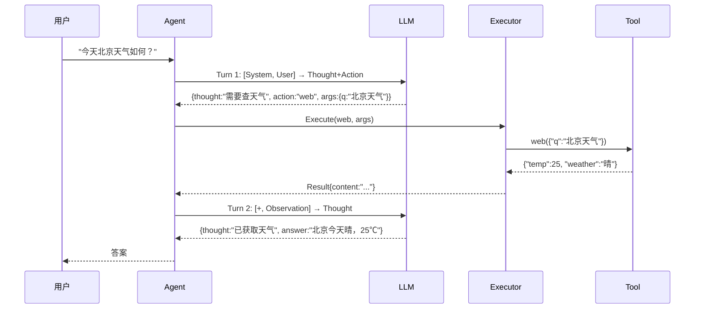

# ReAct 循环详解

> 理解 AgentPrimordia 的核心推理引擎。

## 什么是 ReAct？

**ReAct = Reasoning + Acting**，让 LLM 在思考的同时调用工具，结合推理能力和外部知识。

## 循环机制



## ReAct Loop 配置

```go
agent, err := ap.NewAgent("weather-agent", "你是天气助手。", provider,
    ap.WithMaxTurns(10),   // 最大循环次数（防止无限循环）
    ap.WithMemory(mem),
)
```

## 关键参数

| 参数 | 默认 | 说明 |
|------|------|------|
| `max_turns` | 10 | 思考+行动的最大轮次 |
| `max_tokens` | 4096 | 每次 LLM 调用的 token 上限 |
| `temperature` | 0.7 | LLM 采样温度 |
| `timeout` | 120s | 单次 Agent 运行超时 |

## 调试 ReAct Loop

开启 trace 模式查看完整步骤：

```yaml
agent:
  trace: true         # 输出每一步的 Thought/Action/Observation
  trace_output: ./logs/react.jsonl
```

或通过 VS Code Inspector 实时可视化步骤。

## 常见问题

**Q: 循环超过 max_turns？**
A: 说明任务复杂或 Action 选择不对。尝试优化 SystemPrompt 或拆分子任务。

**Q: 循环过早结束（1-2 轮）？**
A: LLM 可能误认为已获取足够信息。在 SystemPrompt 中要求"必须确认答案才能结束"。

**Q: 如何节省 token？**
A: 启用 Memory Summarizer（对话压缩）和 LLM Cache（相同 prefix 复用）。
