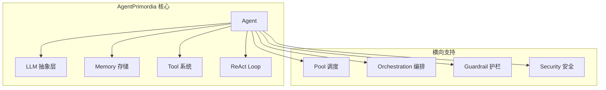

# 核心概念

> AgentPrimordia 的设计哲学与核心抽象。

## 架构总览



## 核心抽象

### Agent（智能体）

Agent 是 ReAct Loop 的载体，包含：
- **System Prompt**：定义 Agent 的身份与行为边界
- **Memory**：对话历史 + 长期知识
- **Tools**：可调用的外部工具集合
- **LLM**：底层大语言模型

### ReAct Loop（思考-行动循环）

```
Thought → Action(tool, args) → Observation → Thought → ... → Final Answer
```

每一轮循环：
1. LLM 输出思考（Thought）
2. LLM 决定调用哪个工具（Action）
3. Executor 执行工具并返回结果（Observation）
4. Observation 注入上下文，进入下一轮

### Memory（记忆系统）

| 后端 | 场景 | 接口 |
|------|------|------|
| InMemory | 临时/测试 | `memory.NewInMemoryStore()` |
| SQLite | 单机持久化 | `memory.NewSQLiteStore(path)` |
| Vector | 语义检索/RAG | `memory.NewVectorStore(dimensions)` |

### Tool（工具系统）

工具是 Agent 与外部世界的桥梁：

```go
type Tool interface {
    Name() string
    Description() string
    Parameters() json.RawMessage
    Execute(ctx context.Context, args json.RawMessage) (*Result, error)
}
```

内置工具：filesystem / shell / web / database / code_execution

### Pool（调度池）

Pool 管理多个 Agent 的并发执行，支持：
- 按租户配额限制并发
- 任务队列与优先级
- Worker 弹性伸缩

### Orchestration（编排）

多 Agent 协作的抽象模式：

| 模式 | 场景 |
|------|------|
| Pipeline | 顺序执行，每阶段一个 Agent |
| Handoff | Agent 完成后传递给下一个 |
| DAG | 有向无环图，支持并行分支 |
| GroupChat | 圆桌讨论，多数决策 |
| Debate | 正反方辩论 + 裁判 |

### Guardrail（护栏）

保障 Agent 安全的中间件：
- **注入检测**：识别并阻断 prompt injection
- **PII 过滤**：脱敏个人身份信息
- **主题边界**：限制 Agent 只能回答特定主题
- **ACL**：基于角色的工具访问控制
