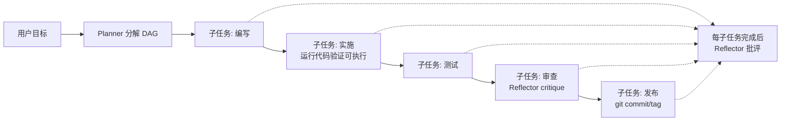

# 一体化 Coding Harness（计划 → 编写 → 实施 → 测试 → 审查 → 发布）

> Go 框架线与 TS SDK 线均已打通该流程，API 与行为对齐：同一个 Agent 装配一次，
> 端到端完成任务分解、代码编写、实际运行验证、测试审查与 git 发布。
> 参考实现：`ecosystem/examples/coding-agent/`（Go）、`sdk/typescript/examples/coding-agent.ts`（TS），
> 端到端回归测试：`test/e2e/coding_pipeline_test.go`（Go）、`sdk/typescript/tests/e2e/coding-pipeline.test.ts`（TS）。

## 流程总览



- **计划**：`agent.Planner`（LLMPlanner）在 run 入口把目标分解为 DAG 子任务；多子任务时按计划执行，单任务退化为普通 ReAct 循环。
- **编写**：内置工具 `filesystem` 读写文件。
- **实施**：编写后立刻经 `shell` 实际运行所写程序（Go 线 `go run hello.go`、TS 线 `node hello.ts`），验证代码真实可执行而非仅存在。
- **测试**：`shell` 跑测试与校验（如 `git status`、语言原生测试命令）。
- **审查**：每个子任务完成后 `Reflector`（LLMReflector）批评，仅当 severity ≥ 阈值时调用 improve 改写并重跑该子任务，省时省 token。
- **发布**：Go 线用 `git` 插件（add/commit/tag/push/status/diff/log），TS 线用 `shell` 驱动 git 命令。

## Go 线装配

```go
provider := llm.NewOpenAICompatible(llm.OpenAICompatibleConfig{
    BaseURL: baseURL, APIKey: apiKey, Model: "your-model",
})

registry := tools.NewRegistry()
fsTool, _ := tools.NewFileSystem(workDir)   // 编写
registry.Register(fsTool)
registry.Register(tools.NewShell())          // 测试/校验
registry.RegisterPlugin(gitplugin.New())     // 发布（tag/push 已支持）

ag := agent.NewAgent("coding-agent", "全自动编码助手", provider,
    agent.WithTools(registry),
    agent.WithPlanner(ap.NewLLMPlanner(provider)),           // 计划
    agent.WithReflector(ap.NewLLMReflector(provider)),       // 审查
    agent.WithReflectionSeverityThreshold("high"),           // 仅高严重度才改写重跑
    agent.WithMaxIterations(8),
)

resp, _ := ag.Run(ctx, ap.UserMessage("创建 hello.go，验证编译，审查后提交并打标签 v1.0.0"))
fmt.Println(resp.Content) // 发布完成：v1.0.0
```

## TS 线装配

```typescript
import { ReActAgent, ToolRegistry, FileSystemTool, ShellTool,
         LLMPlanner, LLMReflector } from 'agentprimordia';

const registry = new ToolRegistry();
registry.register(new FileSystemTool({ rootDir: workDir }));
registry.register(new ShellTool({ workingDir: workDir }));

const agent = new ReActAgent({
  name: 'coding-agent',
  model: provider,
  toolkit: registry,
  maxTurns: 8,
  planner: new LLMPlanner(provider),
  reflector: new LLMReflector(provider),
  reflectionSeverityThreshold: 'high',
});

const resp = await agent.run('创建 hello.ts，验证工作区，审查后提交并打标签 v1.0.0');
console.log(resp.content); // 发布完成：v1.0.0
```

## 护栏入环（v3.4）

Harness 全程由护栏保护，Go / TS 行为对齐：

- **输入端**：用户输入进入循环前检查——PII 自动脱敏（邮箱/手机号/身份证等），高危注入（prompt injection 等）直接拒绝，不消耗任何 LLM 调用。
- **输出端**：每轮 LLM 响应写入消息历史前检查——PII 脱敏、命中 block 规则立即终止运行。

```go
// Go 线：agent.WithInputGuard(g) + guardrail 包的 OutputGuard 接线
ag := agent.NewAgent("coding-agent", "全自动编码助手", provider,
    agent.WithInputGuard(myInputGuard), // 输入端脱敏/拒绝
)
```

```typescript
// TS 线：传入 GuardrailEngine 即同时启用输入端 + 输出端
import { GuardrailEngine } from 'agentprimordia';

const agent = new ReActAgent({
  name: 'coding-agent',
  model: provider,
  toolkit: registry,
  guardrail: new GuardrailEngine(), // 输入脱敏/拒绝 + 输出逐轮检查
});
```

## 协议格式（LLM 需遵守）

| 能力 | 输出格式 |
|------|----------|
| Planner.decompose | JSON 数组：`[{"id":"1","description":"...","depends_on":[]}]` |
| Reflector.critique | JSON：`{"issues":[],"severity":"low|medium|high|critical","corrections":[]}` |
| Reflector.improve | 改写后的子任务描述文本（仅 severity ≥ 阈值时触发） |

severity 低于阈值时直接采纳子任务结果，不做改写重跑——这是「省时省 token」的关键开关。

## 与真实 LLM 的注意事项

- 系统提示中说明工具职责边界（filesystem 负责编写、shell 负责实施/测试、git 负责发布），降低工具选择歧义。
- 发布类工具调用建议限制 `allowed_paths` / `rootDir` / `workingDir`，避免误操作仓库外文件。
- 实施环节用语言运行时命令（`go run`、`node`）实际执行产物；shell 工具已放行这些命令并保留用户级缓存变量（如 `LOCALAPPDATA`），保证编译类命令可运行。
- 测试环节推荐让 Agent 通过 shell 调用语言原生测试命令（`go test ./...`、`npm test`），结果作为下一子任务上下文。
