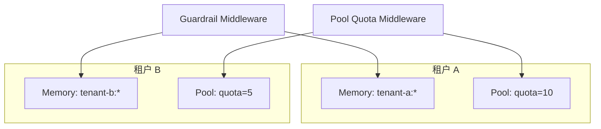

# 多租户部署指南

> 多租户 Memory/Pool/Bus 隔离 + 配额 + 认证集成。

## 架构



## 配置

```yaml
# .ap.yaml
tenant:
  enabled: true
  registry:
    tenants:
      - id: tenant-a
        name: Tenant A
        plan: pro
        quota:
          max_concurrency: 10
          max_tasks_per_minute: 100
      - id: tenant-b
        name: Tenant B
        plan: free
        quota:
          max_concurrency: 3
          max_tasks_per_minute: 30
auth:
  chain:
    - type: api_key
      header: X-API-Key
    # - type: bearer
    #   jwks_url: https://example.com/.well-known/jwks.json
    # - type: mTLS
    #   client_cert_header: X-Client-Cert
```

## 认证流程

1. 每个请求携带 `X-API-Key` 头（或 Bearer / mTLS）
2. `RequireAuth` 中间件解析 `Principal`（含 tenant_id）
3. context 注入 tenant_id
4. Memory Store 自动按 tenant_id 前缀读写
5. Pool 检查租户配额

## 配额限制

```yaml
quota:
  max_concurrency: 10        # 最大并发 Agent 数
  max_tasks_perMinute: 100   # 每分钟最大任务数
  burst: 20                  # 突发令牌数
```

## 编程示例

```go
// 在 HTTP handler 中获取 tenant principal
func handler(w http.ResponseWriter, r *http.Request) {
    principal := admin.PrincipalFromContext(r.Context())
    // principal.Subject, principal.TenantID, principal.Method, principal.Scopes
    ...
}
```

## 扩展

- **OIDC**：对接企业 SSO（Azure AD / Okta / Keycloak）
- **SAML**：企业级 SAML 2.0 集成
- **用量计费**：按租户 token 用量计费
- **审计日志**：所有租户操作可追溯
