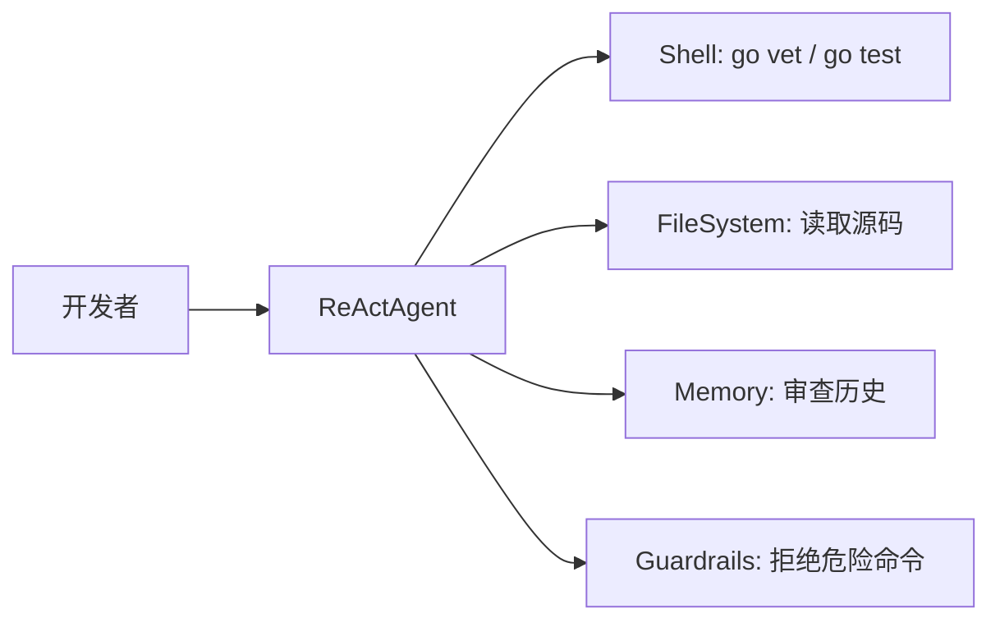

# Cookbook: 代码审查 Agent

用 AgentPrimordia 构建一个能读取代码、运行检查并给出审查意见的 Agent。

## 场景

Agent 读取 Git 仓库中的变更文件，运行 lint/test 命令，分析代码质量并给出改进建议。通过 Shell 工具的命令白名单确保安全。

## 架构



## 完整代码

```go
package main

import (
	"context"
	"fmt"
	"log"
	"os"

	ap "agentprimordia/pkg"
)

func main() {
	// 1. 安全的 Shell 工具：只允许 Go 相关命令
	shell := ap.NewShell(ap.ShellConfig{
		CommandWhitelist: []string{"go", "git", "grep", "wc"},
		Timeout:          30,
	})

	// 2. 文件系统工具：限制在项目目录内
	fs := ap.NewFileSystem(ap.FileSystemConfig{
		RootDir: ".",
	})

	registry := ap.NewToolRegistry()
	registry.Register(fs)
	registry.Register(shell)

	// 3. 审查历史记忆
	memory, err := ap.WithInMemory()
	if err != nil {
		log.Fatal(err)
	}
	defer memory.Close()

	// 4. Hook：记录每次 Shell 执行
	hooks := ap.NewHookManager()
	hooks.Register(ap.HookAfterTool, func(ctx context.Context, hctx *ap.HookContext) error {
		if hctx.ToolCall.Name == "shell" {
			fmt.Printf("[Shell] %s → 耗时 %v\n",
				hctx.ToolCall.Args, hctx.Duration)
		}
		return nil
	})

	// 5. 创建 Agent
	agent, err := ap.NewAgent("CodeReviewer", `你是一个代码审查助手。工作流程：
1. 用 FileSystem 读取变更的源码文件
2. 用 Shell 运行 go vet / go test 检查问题
3. 分析代码质量，给出具体改进建议
4. 用中文输出审查报告`, newProvider(),
		ap.WithMaxTurns(25),
		ap.WithToolkit(registry),
		ap.WithMemory(ap.NewMemoryAdapter(memory)),
		ap.WithHooks(hooks),
	)
	if err != nil {
		log.Fatal(err)
	}

	// 6. 运行审查
	prompt := "审查当前目录下所有 .go 文件的代码质量"
	if envPrompt := os.Getenv("AP_PROMPT"); envPrompt != "" {
		prompt = envPrompt
	}

	resp, err := agent.Run(context.Background(), ap.UserMessage(prompt))
	if err != nil {
		log.Fatal(err)
	}

	fmt.Println("=== 审查报告 ===")
	fmt.Println(resp.Content)
	fmt.Printf("\n工具调用: %d 次 | 轮数: %d\n",
		resp.Metrics.TotalTools, resp.Metrics.TotalTurns)
}

func newProvider() *ap.OpenAIProvider {
	return ap.NewOpenAIProvider(ap.Config{
		APIKey: os.Getenv("OPENAI_API_KEY"),
		Model:  "gpt-4o",
	})
}
```

## 关键 API

- `ap.NewShell(ShellConfig{CommandWhitelist: ...})` — 限制 Shell 只执行白名单命令，防止危险操作
- `ap.NewFileSystem(FileSystemConfig{RootDir: "."})` — 文件访问限制在项目目录内
- `HookAfterTool` — 工具执行后记录日志，用于审计和性能分析
- `ap.NewToolRegistry()` — 手动注册工具，比 DefaultToolkit 更精细地控制权限

## 扩展方向

1. **Git 集成** — 加 `git diff --name-only` 获取变更文件列表，只审查变更部分
2. **PR 集成** — 通过 Web 工具调用 GitHub API，在 PR 上自动评论
3. **多语言支持** — 调整白名单和 SystemPrompt 支持其他语言的代码审查
