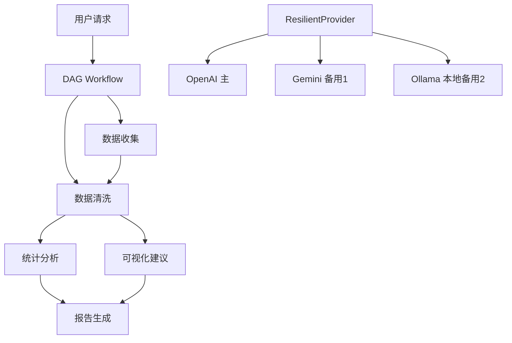

# Cookbook: 多源数据分析 Agent

用 AgentPrimordia 构建一个支持多 Provider 降级和 DAG 编排的数据分析 Agent。

## 场景

Agent 从多个数据源获取数据，按 DAG 依赖顺序依次处理分析任务。当主 LLM Provider 不可用时自动降级到备用 Provider，确保服务稳定。

## 架构



## 完整代码

```go
package main

import (
	"context"
	"fmt"
	"log"
	"os"

	ap "agentprimordia/pkg"
)

func main() {
	// 1. ResilientProvider：主 → 备用1 → 本地备用2
	primary := ap.NewOpenAIProvider(ap.Config{
		APIKey: os.Getenv("OPENAI_API_KEY"),
		Model:  "gpt-4o",
	})

	fallback1 := ap.NewGeminiProvider(ap.Config{
		APIKey: os.Getenv("GEMINI_API_KEY"),
		Model:  "gemini-1.5-pro",
	})

	fallback2 := ap.NewOllamaProvider(ap.Config{
		BaseURL: "http://localhost:11434",
		Model:   "llama3",
	})

	resilient := ap.NewResilientProvider(primary, ap.DefaultResilientConfig())
	resilient.AddFallback(fallback1)
	resilient.AddFallback(fallback2)

	// 2. 工具集
	registry, err := ap.DefaultToolkit(ap.ToolkitConfig{
		RootDir:     "./data",
		EnableFS:    true,
		EnableShell: true,
		EnableWeb:   true,
	})
	if err != nil {
		log.Fatal(err)
	}

	// 3. 记忆
	memory, err := ap.WithInMemory()
	if err != nil {
		log.Fatal(err)
	}
	defer memory.Close()

	// 4. Pipeline 编排：收集 → 清洗 → 分析 → 生成
	collector, _ := ap.NewAgent("DataCollector", "你是数据收集专家，负责从文件和网页获取原始数据。", resilient,
		ap.WithMaxTurns(10),
		ap.WithToolkit(registry),
	)

	analyzer, _ := ap.NewAgent("DataAnalyzer", "你是数据分析专家，负责统计分析和趋势发现。", resilient,
		ap.WithMaxTurns(15),
		ap.WithToolkit(registry),
	)

	reporter, _ := ap.NewAgent("ReportGenerator", "你是报告生成专家，负责将分析结果整理成清晰的报告。", resilient,
		ap.WithMaxTurns(10),
	)

	pipeline := ap.NewPipeline(collector, analyzer, reporter)

	// 5. 运行
	resp, err := pipeline.Run(context.Background(),
		ap.UserMessage("分析 ./data 目录下的销售数据，找出增长趋势并生成报告"))
	if err != nil {
		log.Fatal(err)
	}

	fmt.Println("=== 分析报告 ===")
	fmt.Println(resp.Content)
}

func newProvider() ap.Provider {
	return ap.NewOpenAIProvider(ap.Config{
		APIKey: os.Getenv("OPENAI_API_KEY"),
		Model:  "gpt-4o",
	})
}
```

## 关键 API

- `ap.NewResilientProvider(primary, config)` — 包装主 Provider，自动重试 + 熔断
- `resilient.AddFallback(fallback)` — 添加降级 Provider，主不可用时自动切换
- `ap.NewPipeline(agent1, agent2, agent3)` — 顺序 Pipeline 编排，前一个输出作为后一个输入
- `ap.NewGeminiProvider` / `ap.NewOllamaProvider` — 多 Provider 实例

## 扩展方向

1. **DAG 编排** — 用 `ap.NewDAG` 替代 Pipeline，支持统计分析与可视化建议并行执行
2. **成本控制** — 用 `ap.NewCostTracker` 监控 Token 消耗，设置预算上限
3. **Pool 调度** — 用 `ap.NewPool` 并发处理多个独立数据集的分析任务
