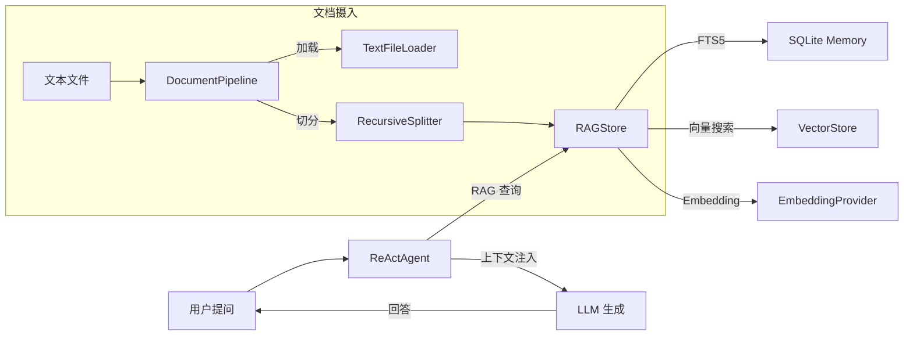

# Cookbook: RAG Agent

用 AgentPrimordia 构建一个企业知识库问答 Agent，从文档中检索相关信息并生成回答。

## 场景描述

企业内部积累了大量技术文档、产品手册和 FAQ，员工需要快速获取准确信息。RAG Agent 通过以下流程解决这一问题：

1. **文档摄入**：加载文本文件，按语义切分为适合检索的块，写入 RAG 存储
2. **混合检索**：结合 FTS5 全文搜索和向量相似度搜索，找到最相关的文档片段
3. **上下文注入**：将检索结果格式化为上下文，注入 Agent 的推理过程
4. **生成回答**：Agent 基于检索到的知识生成准确回答，避免编造内容

## 架构



## 完整代码

```go
package main

import (
	"context"
	"fmt"
	"log"
	"time"

	ap "agentprimordia/pkg"
	"agentprimordia/testutil"
)

func main() {
	ctx := context.Background()

	// ===== 1. 创建 Memory 存储 =====
	// 使用内存模式，适合演示和测试；生产环境用 NewSQLiteStore(path) 持久化
	memStore, err := ap.WithInMemory()
	if err != nil {
		log.Fatalf("创建 Memory 失败: %v", err)
	}
	defer memStore.Close()

	// ===== 2. 创建 Embedding 适配器 =====
	// 将 LLM Provider 适配为 EmbeddingProvider 接口
	// testutil.NewMockProvider 实现了 llm.Embedder，返回 16 维随机向量
	mockProvider := testutil.NewMockProvider("根据知识库信息回答")
	embedder := ap.NewEmbeddingAdapter(mockProvider, 16) // 16 维（演示用，生产建议 1536）

	// ===== 3. 创建 RAGStore =====
	// RAGStore 封装了 Memory + VectorStore + EmbeddingProvider，提供混合检索能力
	ragStore := ap.NewRAGStore(memStore, embedder)

	// ===== 4. 文档加载与切分 =====
	// DocumentPipeline 串联加载器和切分器，一步完成 加载 → 切分
	loader := ap.NewTextFileLoader()                   // 支持加载 .txt/.md/.go 等文本文件
	splitter := ap.NewRecursiveSplitter(500, 50)       // 块大小 500 字符，重叠 50 字符
	pipeline := ap.NewDocumentPipeline(loader, splitter)

	// 模拟文档内容：直接向 RAGStore 写入文档块
	// 生产环境用 pipeline.Process(ctx, "./knowledge/") 从目录批量加载
	docs := []struct{ title, content string }{
		{"Go 并发", "Go 语言通过 goroutine 和 channel 实现并发编程。goroutine 是轻量级线程，由 Go 运行时调度。channel 用于 goroutine 间的通信和同步。"},
		{"Go 接口", "Go 的接口是隐式实现的：只要类型实现了接口的所有方法，就自动满足该接口。这称为鸭子类型（Duck Typing）。"},
		{"Go 错误处理", "Go 使用多返回值处理错误：函数返回 (result, error)。调用方应检查 error 是否为 nil。defer/panic/recover 用于异常场景。"},
		{"Go 泛型", "Go 1.18 引入了泛型（类型参数），使用方括号声明类型参数。泛型函数和泛型类型可以编写更通用的代码，同时保持类型安全。"},
		{"Go 模块", "Go 模块是 Go 1.11 引入的依赖管理机制。go.mod 文件声明模块路径和依赖，go.sum 记录依赖的校验和。"},
	}

	for i, doc := range docs {
		episode := &ap.Episode{
			ID:        fmt.Sprintf("doc_%d", i),
			SessionID: "knowledge_base",
			Role:      "document",
			Content:   doc.content,
			CreatedAt: time.Now().Format(time.RFC3339),
			Metadata: map[string]string{
				"title":  doc.title,
				"source": "go-guide",
			},
		}
		if err := ragStore.Add(ctx, episode); err != nil {
			log.Printf("写入文档失败 [%s]: %v", doc.title, err)
		}
	}
	fmt.Printf("已摄入 %d 篇文档\n\n", len(docs))

	// ===== 5. 创建 RAG Provider 适配器 =====
	// 将 memory.RAGStore 适配为 agent.RAGProvider，供 Agent 的 RAG 配置使用
	ragProvider := ap.NewRAGProviderAdapter(ragStore)

	// ===== 6. 创建带 RAG 的 Agent =====
	// 方式 A：使用 NewAgent 简化入口 + 链式 API（推荐）
	agent := ap.NewAgent(
		"rag-agent",
		"你是一个知识库问答助手。根据检索到的参考信息回答用户问题，不要编造内容。",
		mockProvider,
		ap.WithMaxTurns(10),
	).WithMemory(memStore).WithRAG(ap.RAGConfig{
		Provider: ragProvider,
		Mode:     ap.RAGModeAuto, // 每轮推理前自动查询知识库
		TopK:     3,              // 返回最相关的 3 个文档片段
		MinScore: 0.3,            // 过滤相关度低于 0.3 的结果
	})

	// ===== 7. 运行查询 =====
	resp, err := agent.Run(ctx, ap.UserMessage("Go 语言如何处理并发？"))
	if err != nil {
		log.Fatalf("Agent 运行失败: %v", err)
	}

	fmt.Printf("回答: %s\n", resp.Content)

	// ===== 8. RAG 三种模式对比 =====
	fmt.Println("\n--- RAG 模式对比 ---")
	compareRAGModes(ctx, ragProvider, mockProvider)
}

// compareRAGModes 对比 RAG 三种注入模式
func compareRAGModes(ctx context.Context, ragProvider ap.RAGProvider, provider ap.Provider) {
	modes := []struct {
		name string
		mode ap.RAGMode
		desc string
	}{
		{"Auto", ap.RAGModeAuto, "每轮推理前自动查询知识库，适合大多数场景"},
		{"First", ap.RAGModeFirst, "仅在第一轮推理前查询，后续轮次复用上下文，节省 Token"},
		{"OnDemand", ap.RAGModeOnDemand, "不自动查询，Agent 主动调用 knowledge_search 工具时才查询"},
	}

	for _, m := range modes {
		fmt.Printf("\n模式: %s — %s\n", m.name, m.desc)

		agent := ap.NewAgent(
			fmt.Sprintf("rag-%s", m.name),
			"你是知识库问答助手。",
			testutil.NewMockProvider(fmt.Sprintf("[%s模式] 回答", m.name)),
			ap.WithMaxTurns(5),
		).WithRAG(ap.RAGConfig{
			Provider: ragProvider,
			Mode:     m.mode,
			TopK:     3,
		})

		resp, err := agent.Run(ctx, ap.UserMessage("Go 的泛型是什么？"))
		if err != nil {
			fmt.Printf("  运行失败: %v\n", err)
			continue
		}
		fmt.Printf("  回答: %s\n", resp.Content)
	}
}
```

## 关键配置说明

### TopK（检索数量）

| 值 | 适用场景 | 说明 |
|---|---|---|
| 3-5 | 通用问答 | 平衡召回率和上下文长度 |
| 1-2 | 精确查询 | 如定义查询、事实核查 |
| 8-10 | 综合分析 | 需要多角度信息的复杂问题 |

TopK 越大，注入的上下文越多，Token 消耗也越高。建议从 3 开始，根据回答质量调整。

### MinScore（最低相关度）

| 值 | 适用场景 | 说明 |
|---|---|---|
| 0 | 宽松 | 返回所有结果，可能引入噪声 |
| 0.3 | 默认 | 过滤明显不相关的结果 |
| 0.5-0.7 | 严格 | 只保留高相关度结果，适合精确问答 |

MinScore 过高可能导致无检索结果，Agent 将无法获取参考信息。建议先设为 0 观察检索质量，再逐步提高。

### RAGMode 选择策略

| 模式 | 查询频率 | Token 消耗 | 适用场景 |
|---|---|---|---|
| `RAGModeAuto` | 每轮 | 高 | 多轮推理需要持续参考知识库 |
| `RAGModeFirst` | 仅首轮 | 中 | 单轮问答、知识库信息变化少 |
| `RAGModeOnDemand` | 按需 | 低 | Agent 自主决定何时查询，工具调用场景 |

## 进阶用法

### 混合检索（FTS5 + 向量）

RAGStore 的 `HybridSearch` 方法同时使用 FTS5 全文搜索和向量相似度搜索，对两种结果加权融合：

```go
// HybridSearch 是 RAGStore 的默认检索方式
// FTS 结果权重 0.4，向量结果权重 0.6
// 同时被两种方式命中的文档会获得更高分数
results, err := ragStore.HybridSearch(ctx, "Go 并发模型", 5)

// 也可以只使用向量搜索（适合语义匹配场景）
results, err = ragStore.Query(ctx, "Go 并发模型", 5)
```

混合检索的优势：
- **FTS5**：精确关键词匹配，适合专有名词、代码片段
- **向量搜索**：语义相似度匹配，适合自然语言描述
- **融合**：两种方式互补，召回率更高

### 自定义上下文模板

通过 `RAGConfig.ContextTemplate` 自定义检索结果注入 Prompt 的格式：

```go
agent := ap.NewAgent("custom-ctx", "你是知识库助手。", provider,
	ap.WithMaxTurns(10),
).WithRAG(ap.RAGConfig{
	Provider: ragProvider,
	Mode:     ap.RAGModeAuto,
	TopK:     5,
	// 自定义模板，{{context}} 占位符会被替换为检索结果
	ContextTemplate: `以下是知识库中检索到的参考信息：

{{context}}

请严格基于以上参考信息回答用户问题。如果参考信息不足，请明确说明。`,
})
```

也可以使用 `ap.FormatRAGContext` 手动格式化检索结果：

```go
// 直接调用 RAGStore 检索
results, _ := ragStore.HybridSearch(ctx, "查询内容", 5)

// 格式化为可注入 Prompt 的上下文文本
contextText := ap.FormatRAGContext(results)
fmt.Println(contextText)
// 输出:
// === 相关记忆 ===
// [相关记忆 | 相关度: 0.85] document: Go 语言通过 goroutine...
// === 记忆结束 ===
```

### 与 Memory 集成实现长期记忆

RAG Agent 结合 Memory 存储可以实现跨会话的长期记忆——Agent 既能检索知识库文档，也能回忆历史对话：

```go
// 1. 创建持久化 Memory（生产环境）
memStore, _ := ap.NewSQLiteStore("./data/agent-memory.db")
defer memStore.Close()

// 2. 创建 RAGStore（共享同一个 Memory）
ragStore := ap.NewRAGStore(memStore, embedder)

// 3. 写入知识库文档
ragStore.Add(ctx, &ap.Episode{
	ID: "doc_1", SessionID: "knowledge", Role: "document",
	Content: "产品 A 的价格是 299 元。",
})

// 4. 对话历史也会自动存入 Memory，后续查询可同时检索到
memStore.Add(ctx, &ap.Episode{
	ID: "conv_1", SessionID: "session-001", Role: "user",
	Content: "我之前问过产品 A 的价格",
})

// 5. Agent 同时拥有 RAG 检索和对话记忆
agent := ap.NewAgent("memory-rag-agent", "你是客服助手。", provider,
	ap.WithMaxTurns(10),
).WithMemory(memStore).WithRAG(ap.RAGConfig{
	Provider: ap.NewRAGProviderAdapter(ragStore),
	Mode:     ap.RAGModeAuto,
	TopK:     5,
})
```

### 端到端 RAG 生成（RetrievalAugmentedGenerator）

`ap.NewRetrievalAugmentedGenerator` 封装了完整的「检索 → 上下文组装 → LLM 生成」流程，适合不需要 Agent 推理循环的简单问答场景：

```go
// 创建 LLMGenerator 适配器
// 需要实现 ap.LLMGenerator 接口（仅一个 Generate 方法）
type llmGeneratorAdapter struct {
	provider ap.Provider
}

func (g *llmGeneratorAdapter) Generate(ctx context.Context, prompt string) (string, error) {
	resp, err := g.provider.Complete(ctx, &ap.CompletionRequest{
		Messages: []ap.ChatMessage{{Role: "user", Content: prompt}},
	})
	if err != nil {
		return "", err
	}
	return resp.Content, nil
}

// 创建端到端 RAG 生成器
generator, err := ap.NewRetrievalAugmentedGenerator(ap.RAGGeneratorConfig{
	Store:     ragStore,                         // RAG 存储
	Generator: &llmGeneratorAdapter{provider},   // LLM 生成器
	TopK:      5,                                // 检索数量
	MinScore:  0.3,                              // 最低相关度
	UseHybrid: true,                             // 启用混合检索
	SystemPrompt: `你是企业知识库助手。请基于以下参考信息回答问题。
如果参考信息不足以回答，请明确说明。

参考信息：
{context}

要求：
1. 仅基于参考信息回答，不要编造
2. 引用具体来源`,
})
if err != nil {
	log.Fatal(err)
}

// 端到端查询：检索 → 组装上下文 → LLM 生成
result, err := generator.Ask(ctx, "Go 语言的并发模型是什么？")
if err != nil {
	log.Fatal(err)
}

fmt.Printf("答案: %s\n", result.Answer)
fmt.Printf("来源数: %d\n", len(result.Sources))
fmt.Printf("上下文:\n%s\n", result.Context)

// 仅检索不生成（用于预览检索结果）
results, _ := generator.RetrieveOnly(ctx, "Go 泛型")
for _, r := range results {
	fmt.Printf("[%.2f] %s\n", r.Score, r.Episode.Content)
}
```

## 性能优化

### 向量维度选择

| 维度 | 适用场景 | 内存占用 | 检索质量 |
|---|---|---|---|
| 384 | 小规模/测试 | 低 | 一般 |
| 768 | 中等规模 | 中 | 较好 |
| 1536 | 生产推荐（OpenAI text-embedding-3-small） | 高 | 优秀 |
| 3072 | 高精度要求 | 很高 | 最佳 |

```go
// 生产环境推荐 1536 维（OpenAI 默认）
embedder := ap.NewEmbeddingAdapter(provider, 1536)

// 测试环境可用低维度减少内存
embedder := ap.NewEmbeddingAdapter(mockProvider, 16)
```

### 批量索引

文档摄入时使用 `DocumentPipeline` 批量加载和切分，避免逐条写入的开销：

```go
// 从目录批量加载
pipeline := ap.NewDocumentPipeline(
	ap.NewTextFileLoader(),
	ap.NewRecursiveSplitter(1000, 200), // 较大块适合长文档
)

// 加载整个目录下的文档
chunks, err := pipeline.Process(ctx, "./knowledge-base/")
if err != nil {
	log.Fatal(err)
}

// 批量写入 RAGStore
for _, chunk := range chunks {
	episode := &ap.Episode{
		ID:        fmt.Sprintf("%s_chunk_%d", chunk.Metadata["source"], chunk.ID),
		SessionID: "knowledge_base",
		Role:      "document",
		Content:   chunk.Content,
		CreatedAt: time.Now().Format(time.RFC3339),
		Metadata:  chunk.Metadata,
	}
	ragStore.Add(ctx, episode)
}
```

### 缓存策略

对高频查询启用 LLM 缓存，避免重复调用 LLM API：

```go
// 1. 创建缓存
cache := ap.NewFingerprintCache(10000, time.Hour) // 指纹精确匹配缓存（容量, TTL）

// 2. 包装 Provider（三参：provider, cache, minScore）
cachedProvider, err := ap.NewCachedProvider(provider, cache, 0.85)
if err != nil {
	log.Fatal(err)
}

// 3. 用缓存 Provider 创建 Agent
agent, err := ap.NewAgent("cached-rag", "你是知识库助手。", cachedProvider,
	ap.WithMaxTurns(10),
)
if err != nil {
	log.Fatal(err)
}
agent = agent.WithRAG(ap.RAGConfig{
	Provider: ragProvider,
	Mode:     ap.RAGModeFirst, // First 模式减少重复检索
	TopK:     5,
})
```

### 切分策略选择

| 切分器 | 适用场景 | 特点 |
|---|---|---|
| `NewRecursiveSplitter` | 通用文档 | 按分隔符逐级切分，保留语义完整性 |
| `NewCharacterSplitter` | 纯文本 | 按字符数切分，简单高效 |
| `NewLineSplitter` | 日志/代码 | 按行数切分，保留行完整性 |

```go
// 通用文档推荐 RecursiveSplitter
splitter := ap.NewRecursiveSplitter(1000, 200)

// 代码文档可用较小块，保留函数完整性
codeSplitter := ap.NewRecursiveSplitter(500, 50)
```
