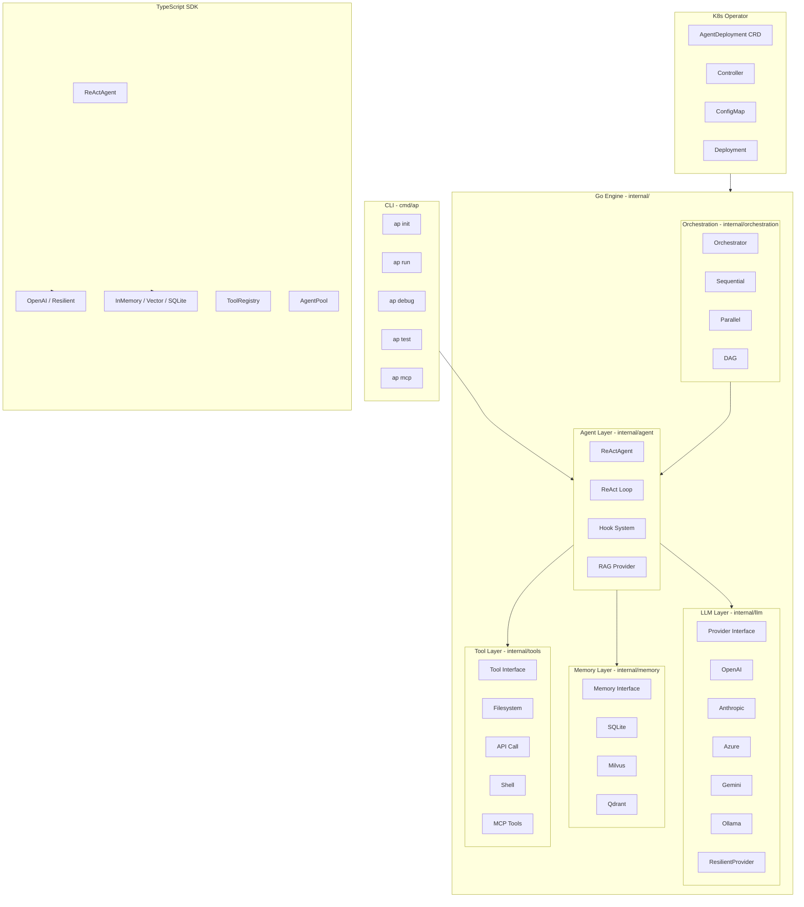
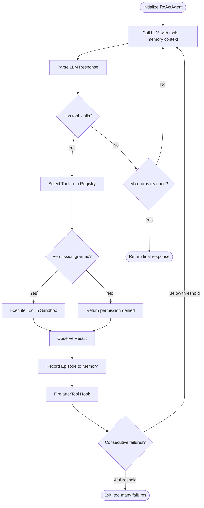
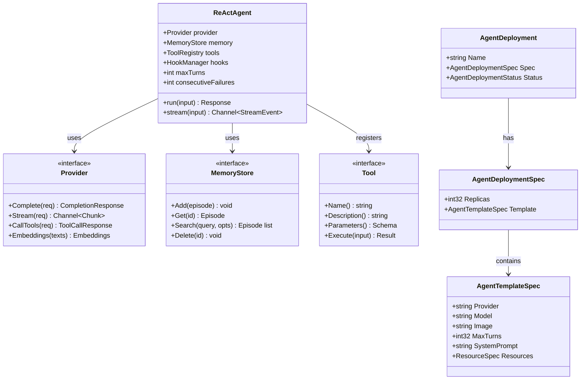
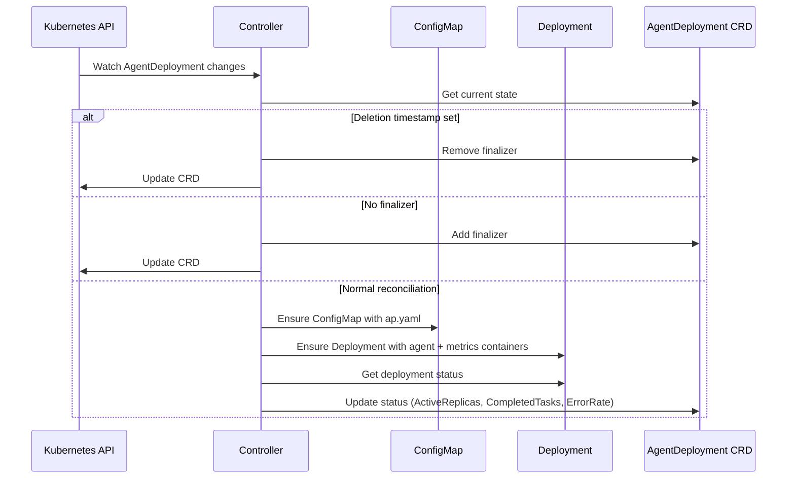
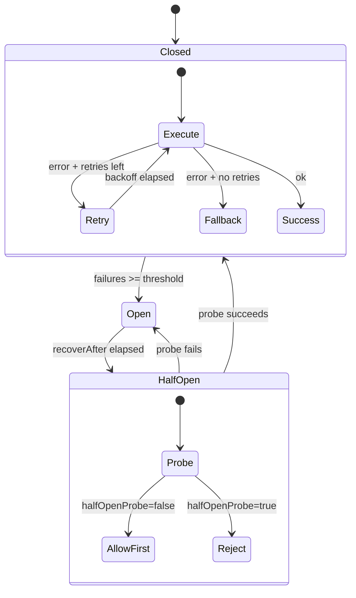
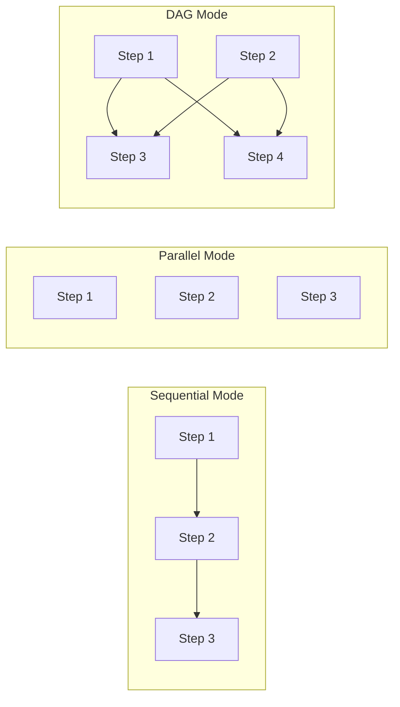

# AgentPrimordia Architecture Diagrams - Mermaid Format

## 1. System Architecture



---

## 2. ReAct Loop Execution Flow



---

## 3. Core Data Structures



---

## 4. Kubernetes Operator Reconciliation



---

## 5. Resilient Provider Pattern



---

## 6. Multi-Agent Orchestration Modes



---

## Usage Instructions

### Preview in Markdown
- **VS Code**: Install "Markdown Preview Mermaid Support" extension
- **GitHub/Gitee**: Auto-render in .md files
- **Typora**: Native Mermaid support

### Export to Image
```bash
npm install -g @mermaid-js/mermaid-cli
mmdc -i architecture-mermaid.md -o architecture.png -w 2400 -H 1800
```
