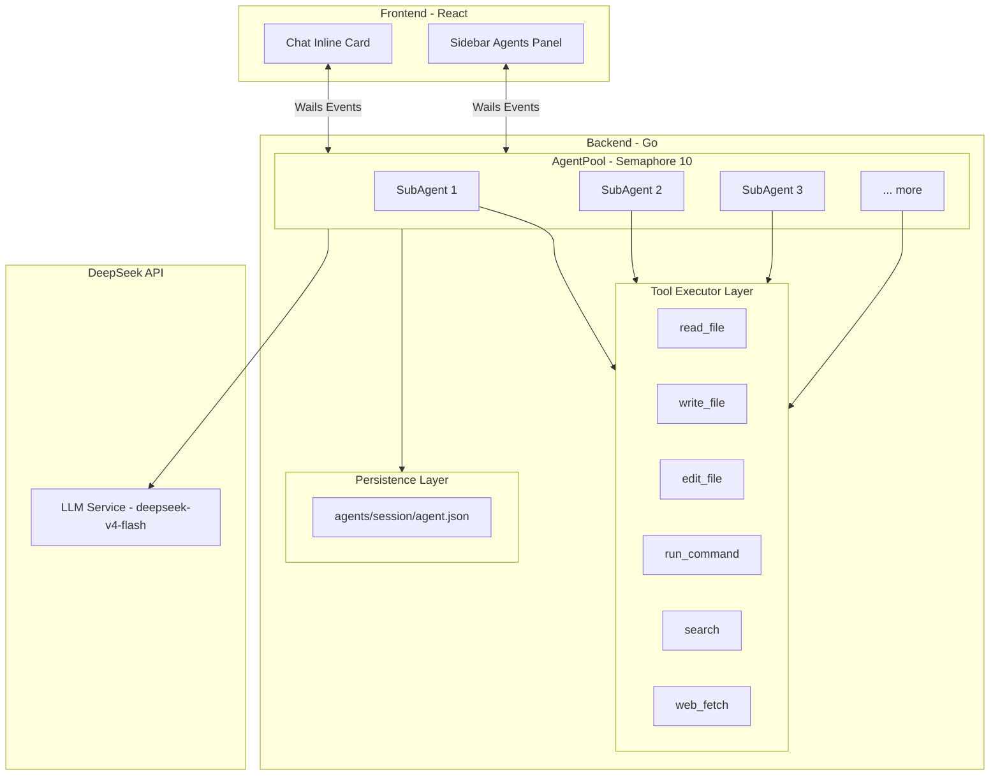
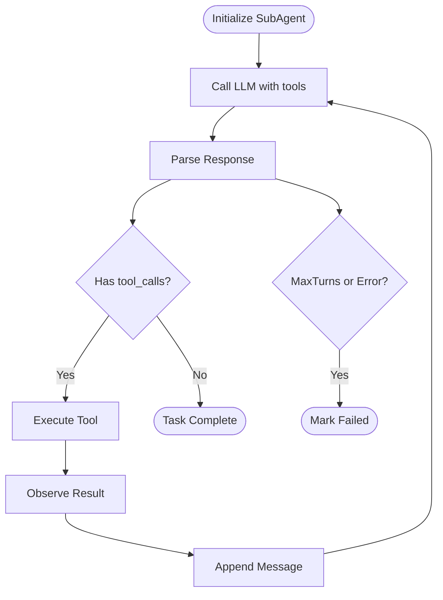
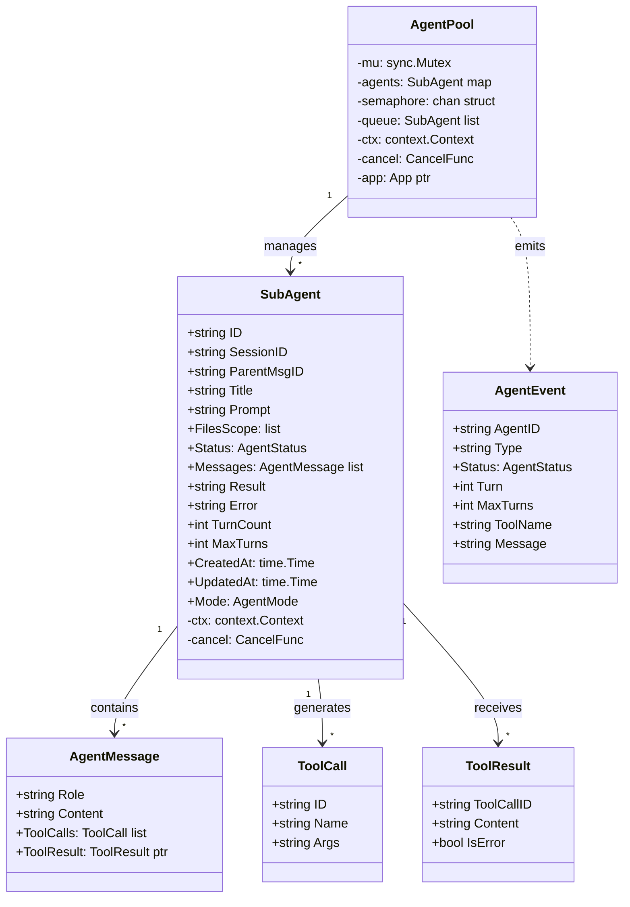
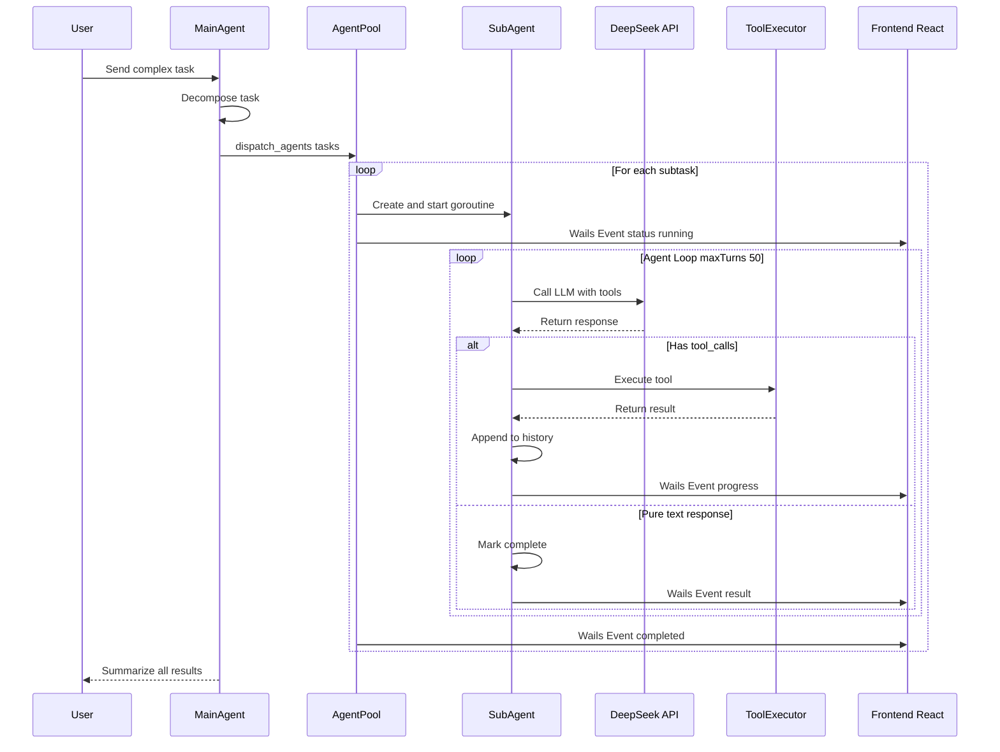
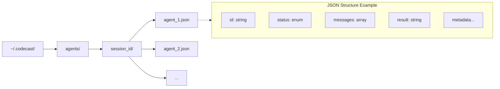

# CodeCast Architecture Diagrams - Mermaid Format

## 1. System Architecture



---

## 2. Agent Loop Execution Flow



---

## 3. Data Structure Relationship



---

## 4. Component Interaction Sequence



---

## 5. File System Structure



---

## Usage Instructions

### Preview in Markdown
- **VS Code**: Install "Markdown Preview Mermaid Support" extension
- **GitHub/Gitee**: Auto-render in .md files
- **Typora**: Native Mermaid support

### Export to Image
```bash
# Using mmdc (Mermaid CLI)
npm install -g @mermaid-js/mermaid-cli
mmdc -i architecture-mermaid.md -o architecture.png -w 2400 -H 1800
```

### Online Editor
- [Mermaid Live Editor](https://mermaid.live/)
